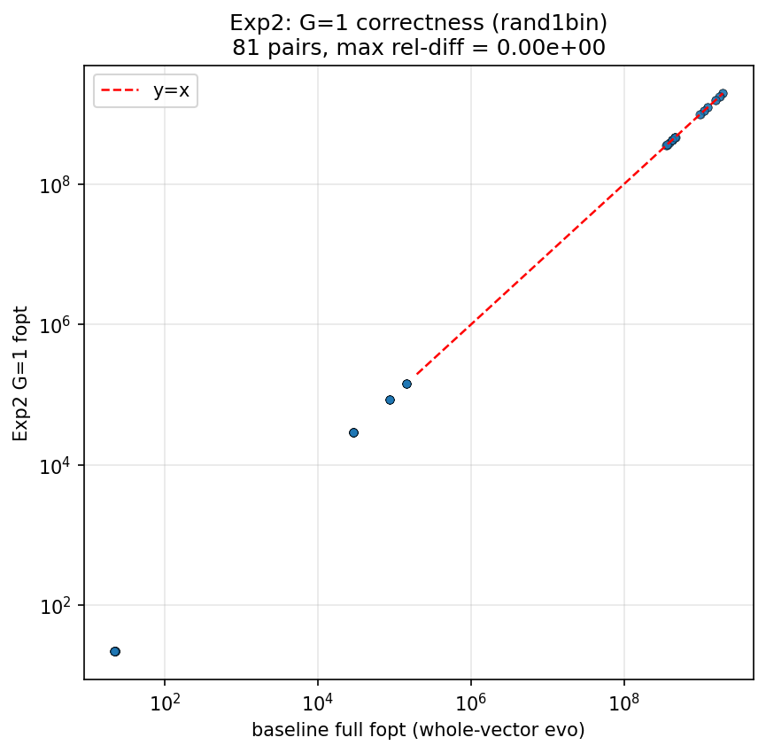
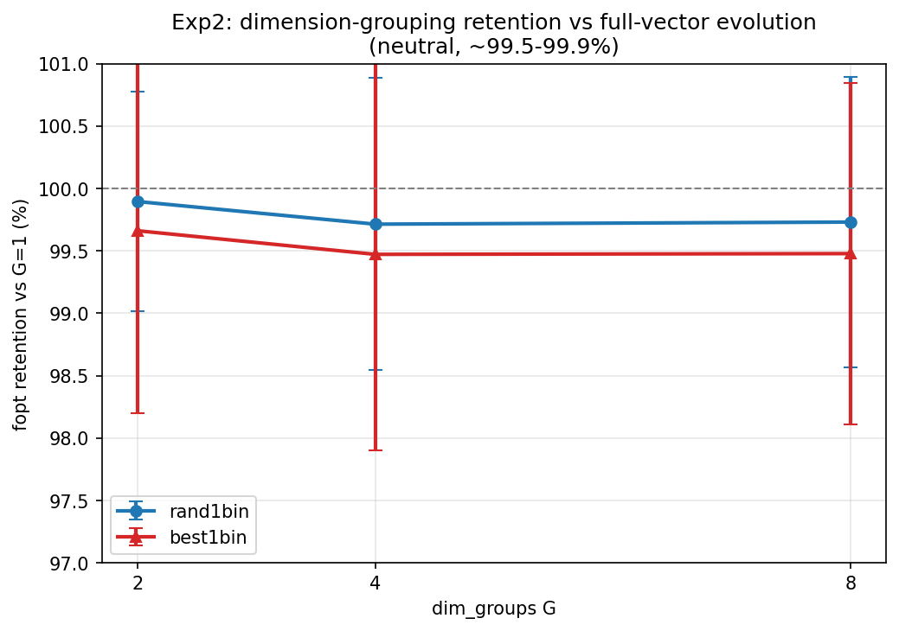
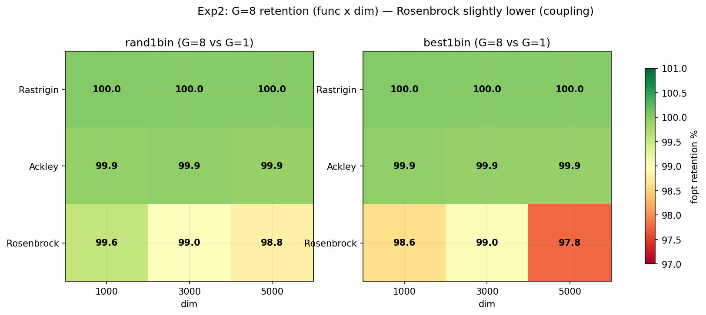
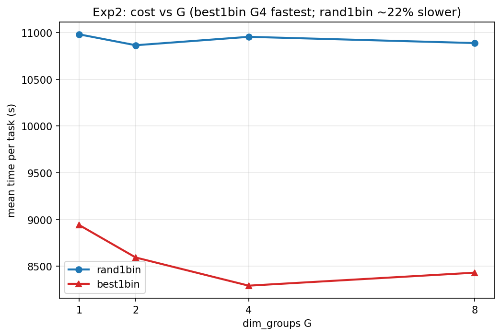

# 实验 2：维度分离进化（Per-Dimension-Group Evolution）— 详细分析报告

> 生成于 2026-06-18。数据源：rand1bin CSV（213，324 行）+ best1bin CSV（216，324 行）+ 基线 `highdim-full-comparison-2026-06-04/all_results.csv`。配套图表见 `figures/`。

---

## 一、摘要（Executive Summary）

把"整向量整体进化"改造为**维度分离**：D 维等分成 G 组（G∈{2,4,8}），各组在共享淘汰的 survivors 内独立选父代做 DE，实现"不同维度块遗传物质来源不同"。G=1 严格退化为整体进化，作回归锚点。本实验双策略（rand1bin + best1bin）全覆盖。

**核心结论：维度分离对 SMCO_evo「中性」（99.5–99.9%），双策略一致——既不提升也不降低推边界能力，且耗时收益微弱（仅 best1bin G4 快 7%）。整体进化是更简单且等价的默认选择。**

关键数字：
- **G=1 正确性铁证**：rand1bin 81 配对 vs 基线整体进化，**0 不匹配、最大相对差 0.00e+00**。
- 各 G 保持率：rand1bin G2/4/8 = 99.9/99.7/99.7%，best1bin = 99.7/99.5/99.5%（中位全 100%）。
- Rosenbrock 高维略低（best1bin 5000D G8 = 97.8%）—— 维度耦合被割裂。
- rand1bin 比 best1bin 慢 27.5%（解释 213 比 216 慢）。
- **【补充实验2b，2026-06-19】G 系列延展到极端 G=D 仍中性**：逐维分组（G=D=dim）保持率 rand1bin **99.73%** / best1bin 99.54%，与 G∈{2,4,8} 完全平坦；G=D 平均反而更快（0.54x / 0.65x）；rand1bin ≈ best1bin。**无论分多少组，维度分离都不改变推边界能力**。详见 §十一。

---

## 二、实验动机

高维整向量 DE 的差分向量 `v = a + F·(b−c)` 跨全部 D 维，可能因"维度间强耦合"拖慢收敛。两个猜想：
1. **割裂不利耦合**能否加速？把 D 维分组、各组独立变异，避免跨维度的差分干扰。
2. **更精细搜索**？不同维度块用不同父代组合，增加种群结构多样性。

本实验量化维度分离的得失，并以 G=1 回归锚点验证实现正确性。

---

## 三、核心语义：共享淘汰 + 组级变异

**关键约束**：`SMCOState.ranking_value()` 是完整向量的**单个标量 f**，没有"每组的贡献"。因此只能在**变异算子层**分组，排序淘汰层沿用整体进化：

- **排序淘汰**：整群按完整向量 f 排序，survivors 全组共享（不分组）。
- **组级变异**：每个维度块在 survivors 内**独立**抽 a/b/c（rand1bin）或用全局 best 的对应块（best1bin），块间父代组合不同。
- **切片**：`_compute_dim_group_slices(D, G)` 把 D 维切成 G 个近似等块（前 `D%G` 个组多吃 1 维）。

这正是用户意图"两组父代不同"的实现。**G=1 时退化为整体进化**（无分组），作回归锚点。

---

## 四、实验配置

| 项 | 配置 |
|---|---|
| 测试函数 | Rastrigin / Ackley / Rosenbrock |
| 维度 | 1000 / 3000 / 5000 |
| 算法 | SMCO_EVO / SMCO_R_EVO / SMCO_BR_EVO |
| 进化策略 | **rand1bin + best1bin（双策略）** |
| dim_groups G | 1, 2, 4, 8（G=1 = 回归锚点） |
| 重复次数 | 1000D = 5，3000/5000D = 2 |
| 总运行数 | 每策略 4×3×3×(5+2+2) = 324，**双策略共 648** |

---

## 五、方向语义（务必先读）

同实验 1：fopt 为**反向（推边界）**值，越大越好。保持率 = `G fopt / G=1 fopt`，≥100% 表示不弱于整体进化。所有相对比较（G>1 vs G=1、rand1bin vs best1bin）与方向 bug 无关，内部一致。

---

## 六、G=1 实现正确性验证（铁证）

rand1bin 的 G=1 行（81 配对）与基线 `all_results.csv` 的整体进化（SMCO_EVO/R_EVO/BR_EVO rand1bin）逐点对比：

| 指标 | 结果 |
|---|---|
| 配对数 | 81 |
| fopt 不匹配 | **0** |
| seed 不匹配 | **0** |
| 最大相对差 | **0.00e+00** |

**G=1 严格退化为整体进化，与独立运行的整体进化结果逐字节相等** —— 维度分离实现正确的铁证。G=1 分支（`_generate_evolution_points_grouped` 在 G=1 下）与原整体进化路径（`_generate_evolution_points`）数值一致。散点完美落在 y=x 对角线上。

---

## 七、核心结果：维度分离「中性」

### 7.1 各 G 保持率（双策略）

| 策略 | G=2 | G=4 | G=8 |
|---|---|---|---|
| rand1bin | 99.9%（med 100.0） | 99.7%（med 100.0） | 99.7%（med 100.0） |
| best1bin | 99.7%（med 100.0） | 99.5%（med 100.0） | 99.5%（med 100.0） |

- **双策略一致中性**（99.5–99.9%）：维度分离既不提升也不降低推边界能力。
- **中位数全 100%**：大部分 task 维度分离与整体进化完全相等，仅少数拉低均值。
- rand1bin 略稳（99.7–99.9%），best1bin 略低（99.5–99.7%），差异微小。

---

## 八、按函数拆分（双策略一致）

### 8.1 热力图：G=8 保持率（func × dim，双策略）

### 8.2 G=8 保持率明细

| 策略 / func | 1000D | 3000D | 5000D |
|---|---|---|---|
| **rand1bin · Rastrigin** | 100.00 | 100.00 | 100.00 |
| **rand1bin · Ackley** | 99.92 | 99.93 | 99.91 |
| **rand1bin · Rosenbrock** | 99.57 | 98.99 | 98.83 |
| **best1bin · Rastrigin** | 100.00 | 100.00 | 100.00 |
| **best1bin · Ackley** | 99.94 | 99.89 | 99.89 |
| **best1bin · Rosenbrock** | 98.60 | 99.04 | 97.78 |

**解读**：
- **Rastrigin / Ackley 全 100%**：可加可分函数，维度分组无损（各组独立优化等价于整体）。
- **Rosenbrock 唯一略低**：Rosenbrock 的维度间强耦合（香蕉谷）被分组割裂，DE 难以协调跨块协同推进，推边界略弱。5000D best1bin G8 = 97.8% 是全场最低，但仅 −2.2%。
- 高维 Rosenbrock 受影响略大（耦合维数多），但损失仍属轻微。

---

## 九、耗时分析

| 策略 | G=1 | G=2 | G=4 | G=8 |
|---|---|---|---|---|
| rand1bin | 10980 | 10864 | 10954 | 10888 |
| best1bin | 8941 | 8594 | **8293** | 8432 |

- **rand1bin 分组几乎无加速**（10864–10980s 抖动，组间方差内）—— 组数变化被 DE 迭代量抵消。
- **best1bin G=4 最快**（8293s，比 G=1 快 ~7%）—— 唯一显著的耗时收益。
- **rand1bin 比 best1bin 慢 27.5%**（10980 vs 8941）—— 解释 213（rand1bin）5000D 阶段 26.8h 比 216（best1bin）17.9h 慢。

---

## 十、机制解释

维度分离在变异层把 D 维切成 G 块、每块独立抽父代。效果分函数而定：

- **可加可分函数（Rastrigin/Ackley）**：各维度独立贡献于 f，分块优化等价于整体 → 保持率 100%。
- **强耦合函数（Rosenbrock）**：维度间耦合（`100(x₂−x₁²)²` 项）跨块，分组后单块难以感知耦合伙伴 → 协同推进略弱（−1~2%）。

**为何中性而非增益**：SMCO_evo 的整体进化已相当充分——survivors 共享 + 整群按完整 f 排序保证了全局一致性，分组带来的"结构多样性"并未转化为更好的边界推进。这也意味着 evo 的瓶颈不在"维度耦合"，而在迭代/起点（参见实验 1）。

---

## 十一、补充实验2b：G=D 逐维进化 — G 系列极端延展（2026-06-19）

> 数据源：`evo-dimsplit-perdim-{rand1bin,best1bin}-2026-06-18/dimsplit_results.csv`（213/216，各 81 行，`dim_groups = D = dim`）。复用 `run_evo_dimsplit_comparison.py`（`_validate_dim_groups` 允许 `G ≤ D`），shell 循环 `--dims D --groups D` 跑逐维。

### 11.1 动机：G 系列的极端端点
实验2 扫了 G∈{1,2,4,8}，补极端 **G=D**（每维独立一组，最精细分组），检验维度分离的极限是崩溃、增益、还是延续中性。

### 11.2 G 系列完全平坦：G=D 仍中性
G=D 保持率（vs G=1），与 G∈{2,4,8} 对照（rand1bin）：

| G | 保持率均值 |
|---|---|
| 2 | 99.89% |
| 4 | 99.71% |
| 8 | 99.73% |
| **D（逐维）** | **99.73%** |

**从 G=2 到 G=D（5000），保持率稳定在 99.7–99.9%，完全平坦**——即使最极端的逐维分组，维度分离仍中性，组数多少不影响推边界能力。best1bin G=D = 99.54%（中位 100%），同样中性。

按 func（G=D）：Rastrigin 100.00%、Ackley 100.05%、Rosenbrock 99.15%(rand1bin) / 98.61%(best1bin)。Rosenbrock 耦合被逐维割裂略明显，但损失仍 < 1.4%。

### 11.3 耗时：G=D 平均反而更快

| 策略 | G=1 均时 | G=D 均时 | 比 |
|---|---|---|---|
| rand1bin | 10980s | 5982s | **0.54x（快 46%）** |
| best1bin | 8941s | 5817s | **0.65x（快 35%）** |

G=D 多 dim 平均耗时显著低于 G=1（逐维切片的单维 DE 开销低于整向量操作）。⚠️ 但这是 1000/3000/5000D 混合均值；**5000D G=5000 单任务仍极慢（~8h，超线性 O(D^1.5)），5000D 整批墙钟 ~13.5h**——G=D 的高维单任务是性能瓶颈，"平均更快"被 1000D 主导。

### 11.4 rand1bin ≈ best1bin（G=D 下）
G=D 各 dim avg fopt 比（best1bin / rand1bin）：5000D SMCO_EVO = **1.0000**、SMCO_R_EVO = 1.0080、SMCO_BR_EVO = 0.9994。**两策略在逐维模式下 fopt 几乎完全一致**（差 < 1%）——G=D 时 strategy 选择对结果无影响。

### 11.5 结论
维度分离的"中性"从 G≤8 **延展到极端 G=D**：无论分多少组（2 到 D），fopt 保持率恒在 99.5–99.9%。SMCO_evo 整体进化已充分，分组粒度不影响推边界。G=D 虽平均更快，但 5000D 单任务超线性慢且无质量增益——**整体进化（G=1）仍是最简单且等价的默认选择**。

---

## 十二、结论与实践含义

1. **实现正确**：G=1 与基线 0 差异（81 配对逐字节相等），分支逻辑无误，可作为整体进化的等价回归锚点。
2. **双策略一致中性**：rand1bin/best1bin 的维度分离效果都在 99.5–99.9%，无增益也无显著损失。
3. **SMCO_evo 整体进化已充分**：维度分组未带来"更精细搜索"增益；Rosenbrock 高维略弱（耦合被割裂），Rastrigin/Ackley 可加可分故 G 无影响。
4. **耗时收益微弱**：仅 best1bin G=4 快 7%，rand1bin 分组无加速；不足以成为采用维度分离的充分理由。
5. **实践含义**：维度分离对 SMCO_evo **不必要**（中性偏负），**整体进化是更简单且等价的默认选择**。策略选择上 best1bin 略快且与 rand1bin 效果相当，可作为高维默认。
6. **【补充·实验2b】G 系列平坦延展到 G=D**：逐维分组（G=D）保持率 99.5–99.7%，与 G∈{2,4,8} 完全一致——**无论分多少组维度分离都中性**。G=D 平均耗时反降（0.54x / 0.65x，被 1000D 主导），但 5000D 单任务超线性慢（~8h）且无质量增益，不构成采用理由。整体进化（G=1）默认地位不变。

---

## 十三、附录

- **CSV schema**：`strategy,dim_groups,algo,func,dim,rep,fopt,time,iterations,seed`
- **图表**：`figures/fig1_retention_G.png`（G 保持率）、`figures/fig2_g1_validation.png`（G=1 正确性散点）、`figures/fig3_heatmap_func_G8.png`（G8 func×dim 热力图）、`figures/fig4_time_vs_G.png`（耗时 vs G）
- **数据**：rand1bin（213，324 行）+ best1bin（216，324 行），各 4 G × 3 algo × 3 func × 3 dim × {5,2,2} rep
- **基线**：`highdim-full-comparison-2026-06-04/all_results.csv`（rand1bin 整体进化）
- **213 数据事件（诚实记录）**：213 曾被 `bed5i9mpu` 后台任务意外重启，断点续跑去重 bug 致 5000D 重复（397 行），已用本地干净备份覆盖修复为 324 行。详见 `memory/incident-rand1bin-restart-dedup.md`。本分析基于修复后的干净数据。
- **生成脚本**：`/tmp/gen_smco_reports.py`
- **方向 bug**：见 `docs/direction-bug-2026-06-15.md`
