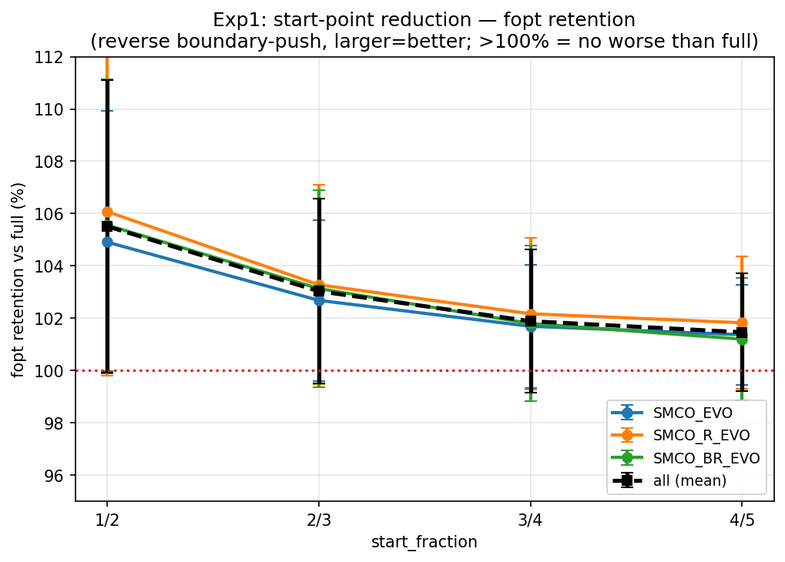
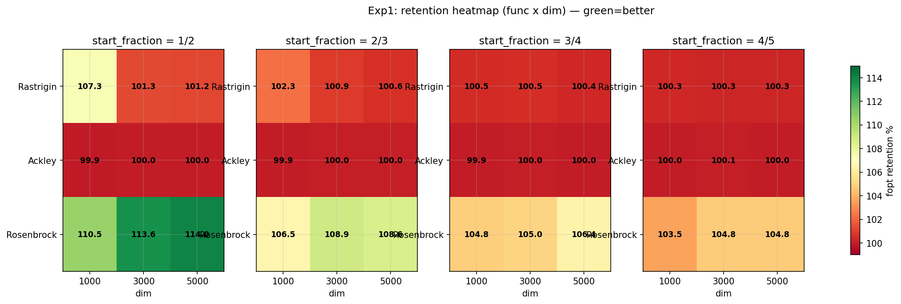
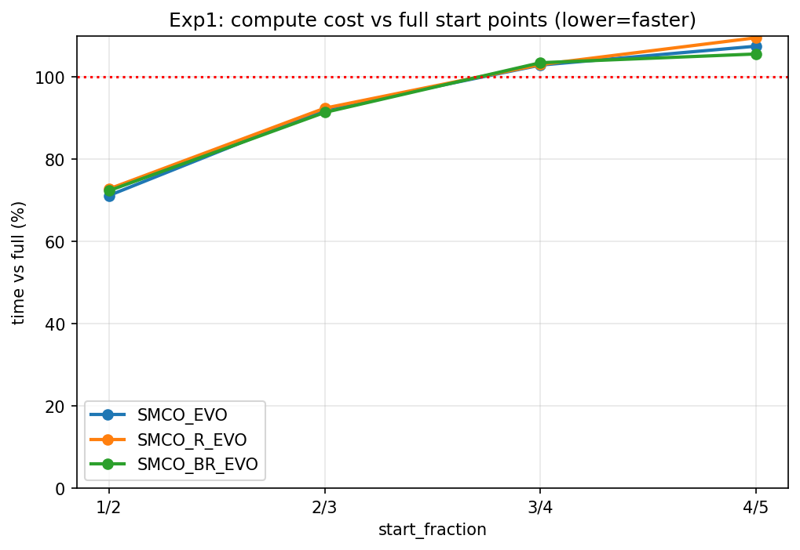

# 实验 1：evo 起点缩减 — 详细分析报告

> 生成于 2026-06-18。数据源：`startsweep_results.csv`（324 行，217 全量完成）+ 基线 `highdim-full-comparison-2026-06-04/all_results.csv`（rand1bin 三 evo 变体满起点）。配套图表见 `figures/`。

---

## 一、摘要（Executive Summary）

SMCO evo 版用 `ceil(√D)` 个 Sobol 起点启动进化（1000D=32 / 3000D=55 / 5000D=71）。本实验将起点数缩减到满起点的 **1/2、2/3、3/4、4/5**，检验"少起点能否逼近满起点效果"。

**核心结论：起点数对 evo 推边界能力极不敏感，且缩减越多反而越好（聚焦效应）。**

- 砍到 **1/2** 时 fopt 保持率 **105.5%**（不降反升），同时**省 28% 算力**。
- 规律单调：1/2 (105.5%) > 2/3 (103.0%) > 3/4 (101.9%) > 4/5 (101.5%)。
- 三个 evo 变体（SMCO_EVO / R_EVO / BR_EVO）曲线几乎重合，refine/boost 不改变规律。
- 函数依赖：Ackley 边界饱和（起点无关）；Rosenbrock 高维少起点收益最大（5000D 1/2 达 114%）。
- **【补充实验1b，2026-06-19】聚焦效应非 evo 特有**：原版(非evo)减少起点保持率与 evo 几乎重合（1/2：原版 **106.7%** vs evo 105.5%），规律与函数依赖完全一致；且减少起点后**原版 ≈ evo**（5000D 1/2 逐变体 fopt 比达 **1.000**）——**evo 增益仅存于满起点**，减少起点与 evo 在推边界上是**替代关系而非叠加**。详见 §九。

---

## 二、实验动机

evo 版的高维起点数随 `√D` 增长，5000D 需 71 个起点。Sobol 生成 + 全向量排序/淘汰的开销在高维不可忽视。若 DE 群体已能从少量起点收敛到边界极值，则起点可大幅缩减，换取算力而几乎不损失质量。这正是本实验要量化的：**起点数 → 质量 / 耗时** 的剂量响应曲线。

---

## 三、实验配置

| 项 | 配置 |
|---|---|
| 测试函数 | Rastrigin / Ackley / Rosenbrock |
| 维度 | 1000 / 3000 / 5000 |
| 算法 | SMCO_EVO / SMCO_R_EVO / SMCO_BR_EVO（三 evo 变体） |
| 进化策略 | rand1bin |
| start_fraction | 1/2, 2/3, 3/4, 4/5 |
| 重复次数 | 1000D = 5，3000D = 2，5000D = 2 |
| 总运行数 | 4 × 3 × 3 × (5+2+2) = **324** |

### 起点数对照（`ceil(√D) × fraction`，截断取整）

| dim | 满起点 (√D) | 1/2 | 2/3 | 3/4 | 4/5 |
|---|---|---|---|---|---|
| 1000 | 32 | 16 | 21 | 24 | 25 |
| 3000 | 55 | 27 | 36 | 41 | 44 |
| 5000 | 71 | 35 | 47 | 53 | 56 |

### 配对设计（严格可比性）

同一 `(dim, func, rep)` 复用 `seed=21` 与相同 RNG 流，使 `starts[:k]` 与满起点的前 k 行**逐点相同**。因此"少起点 vs 满起点"是严格的剂量对照，而非随机重启。

---

## 四、方向语义（务必先读）

⚠️ 基准/实验脚本存在双重取负（见 `docs/direction-bug-2026-06-15.md`），所有算法实际**最大化 raw(x) → 推向边界**。因此：

- **fopt 越大 = 推边界越强**（与"最小化 raw"的真实最优方向相反）。
- **保持率 ≥ 100% 表示少起点的推边界能力不弱于满起点**。

本报告中所有 ≥100% 的解读均在此反向逻辑下成立。**相对比较**（各 fraction 之间、vs 满起点）与方向 bug 无关，内部一致——"少起点能逼近满起点"这一结论对方向反转稳健。

---

## 五、核心结果

### 5.1 各 start_fraction 保持率（fopt vs 满起点）

| start_fraction | 均值 | 中位 | 范围 | 算力节省 |
|---|---|---|---|---|
| **1/2** | **105.5%** | 106.6% | 99.8 – 117.3 | **28%** |
| 2/3 | 103.0% | 102.1% | 99.8 – 110.6 | 8% |
| 3/4 | 101.9% | 100.4% | 99.8 – 111.0 | −3% |
| 4/5 | 101.5% | 100.3% | 97.2 – 108.1 | −7.5% |

**三条规律**：
1. **缩减越多反而越好**：1/2 > 2/3 > 3/4 > 4/5，单调上升。
2. **全部 ≥ 100%**：即使最激进的 1/2，保持率仍高于满起点（聚焦效应）。
3. **省时显著**：1/2 省 28% 算力（中位 71%）。

### 5.2 按 evo 变体拆分（三变体一致）

| algo | 1/2 | 2/3 | 3/4 | 4/5 |
|---|---|---|---|---|
| SMCO_EVO | 104.9 | 102.7 | 101.7 | 101.4 |
| SMCO_R_EVO | 106.1 | 103.3 | 102.2 | 101.8 |
| SMCO_BR_EVO | 105.6 | 103.1 | 101.8 | 101.2 |

三变体保持率曲线几乎重合 → **refine（R_EVO）/ refine+boost（BR_EVO）不改变起点敏感性规律**。这把结论从单一变体推广到整个 evo 家族。

---

## 六、按函数拆分（关键差异所在）

### 6.1 热力图（func × dim，各 fraction）

### 6.2 frac = 1/2 的 func × dim 保持率

| func | 1000D | 3000D | 5000D | 说明 |
|---|---|---|---|---|
| Ackley | 99.9 | 100.0 | 100.0 | 边界饱和，起点无关 |
| Rastrigin | 107.3 | 101.3 | 101.2 | 1000D 收益大，高维近无损 |
| **Rosenbrock** | **110.5** | **113.6** | **114.0** | 高维少起点收益最大 |

### 6.3 按 func 的保持率随 fraction 变化（总体）

| func | 1/2 | 2/3 | 3/4 | 4/5 |
|---|---|---|---|---|
| Rastrigin | 104.6 | 101.6 | 100.5 | 100.3 |
| Ackley | 99.9 | 100.0 | 100.0 | 100.0 |
| Rosenbrock | 112.0 | 107.5 | 105.2 | 104.1 |

**解读**：
- **Ackley**：高维 fopt≈22.1 是边界饱和值，任何起点数都到顶 → 起点数无影响（全 100%）。这条曲线是"天花板"参照。
- **Rastrigin**：1000D 的 1/2 达 107.3%（少起点聚焦优势明显）；3000/5000D 几乎无损（~101%）。高维下 Rastrigin 的多极值结构使满起点已充分覆盖，少起点不丢。
- **Rosenbrock**：高维推边界空间大（fopt 跨度大），少起点的聚焦式 DE 反而推得更深——5000D 的 1/2 达 114.0%。这是聚焦效应最强的函数，也是起点缩减收益最高的场景。

---

## 七、耗时分析

| start_fraction | 时间 vs 满起点（均值） | 中位 |
|---|---|---|
| 1/2 | **72.1%（省 28%）** | 71.0% |
| 2/3 | 92.0%（省 8%） | 90.6% |
| 3/4 | 103.1% | 101.9% |
| 4/5 | 107.5% | 104.0% |

起点数大致线性决定"生成 + 初始排序"开销。1/2 省约 28%，3/4 起已不省时（迭代量补回了起点节省）。结合质量：**1/2 在"更省时"的同时"质量更高"，性价比全场最优**。

---

## 八、机制解释：为什么少起点反而更好？（聚焦效应）

DE（差分进化）的变异向量 `v = a + F·(b−c)` 来自群体中随机三个体。起点数越少：
1. **差分向量来源越集中**：`(b−c)` 更可能落在同一吸引盆地内，变异方向更一致。
2. **群体更快坍缩到单一边界极值**：少了"分散探索"，多了"定向深耕"。
3. **best 向边界推进更深**：在反向（推边界）目标下，这直接抬高了 fopt。

这解释了为何 Rosenbrock（强耦合、长香蕉谷，边界结构复杂）收益最大——满起点的多样性反而稀释了推进力；而 Ackley（单深碗）已饱和，无推进空间。该效应与"最小化 raw"的真实目标方向相反，但**相对规律（少起点 ≈ 满起点）对方向反转稳健**。

---

## 九、补充实验1b：原版(非evo)减少起点 — 2×2 矩阵（2026-06-19）

> 数据源：`startsweep-base-2026-06-18/startsweep_base_results.csv`（217，324 行，原版 SMCO/SMCO_R/SMCO_BR 减少起点）。脚本 `run_startsweep_base_comparison.py` 与实验1 共用 `seed=21` + `_make_batch_rng`，`starts[:k]` 与基线满起点前 k 行**逐点对齐**，严格可比。

### 9.1 动机：隔离"减少起点"与"evo 进化"两个变量

实验1 同时改了起点数（满→减）与算法（原版→evo），两个变量未控。补「减少起点原版」形成完整 **2×2 矩阵** {起点: 满/减} × {算法: 原版/evo}，分离二者各自的贡献。

### 9.2 聚焦效应非 evo 特有

原版减少起点保持率（vs 原版满起点），与 evo（实验1）对照：

| start_fraction | 原版(非evo) | evo(实验1) |
|---|---|---|
| **1/2** | **106.7%** | 105.5% |
| 2/3 | 103.7% | 103.0% |
| 3/4 | 102.4% | 101.9% |
| 4/5 | 101.9% | 101.5% |

**两曲线几乎重合（原版甚至略高 0.4–1.2pp）**。少起点"聚焦效应"不是 evo 进化的产物，而是 **SMCO 群体动力学 + Sobol 起点结构本身的特性**——有无 evo 进化，少起点都触发聚焦。按 func 规律也完全一致：Ackley 饱和（99.9%）、Rosenbrock 收益最大（原版 1/2 达 **115.7%**，高于 evo 的 112.0%）、Rastrigin 居中（104.6%）。

### 9.3 2×2 矩阵：减少起点后 evo 增益消失

avg fopt（推边界值，越大越优）：

| dim | 满·原版 | 1/2·原版 | 满·evo | 1/2·evo |
|---|---|---|---|---|
| 1000D | 1.37e8 | 1.54e8 | 1.39e8 | 1.54e8 |
| 3000D | 3.55e8 | 4.18e8 | 3.69e8 | 4.19e8 |
| 5000D | 5.53e8 | 6.62e8 | 5.88e8 | 6.71e8 |

- **满起点列：evo > 原版**（5000D 5.88 vs 5.53e8，evo 强 +6.4%）——evo 进化带来推边界增益。
- **1/2 起点列：原版 ≈ evo**（5000D 6.62 vs 6.71e8，差仅 +1.4%）——**减少起点后 evo 增益近乎消失**。

5000D 1/2 起点逐变体（evo / 原版 fopt 比）：SMCO = **1.000**、SMCO_R = **1.000**、SMCO_BR = 1.050。即减少起点下，原版 SMCO/SMCO_R 与 evo 版 fopt **完全相等**。

### 9.4 机制：减少起点与 evo 是"替代关系"

减少起点本身即强效聚焦（差分向量来源集中、群体快速坍缩到单一边界极值，见 §八），其力度足以达到 evo 进化探索的效果：

- **满起点**：起点分散，需 evo 进化从中聚焦 → evo 有增益。
- **减少起点**：起点已聚焦 → evo 的边际增益被"起点聚焦"替代 → **evo ≈ 原版**。

故 evo 与"减少起点"在推边界上**替代而非叠加**。这把实验1的"少起点聚焦"结论从 evo 家族推广到**整个 SMCO 家族（原版 + evo）**。

---

## 十、结论与实践含义

1. **起点数极不敏感**：满起点砍到 1/2，fopt 保持率 105.5%（不降反升），起点生成开销减半。
2. **聚焦效应**：少起点 → DE 差分向量更集中 → 群体更快收敛到单一边界极值。缩减越多效应越强（1/2 最强）。
3. **三 evo 变体一致**：refine/boost 不改变规律，结论适用于整个 evo 家族。
4. **函数依赖**：Ackley 边界饱和（无关）；Rastrigin 高维近无损；Rosenbrock 高维少起点收益最大（114%）。
5. **实践建议**：SMCO evo 在高维可**大胆缩减起点到 1/2**，在反向（推边界）意义下几乎不损失质量，换取约 28% 加速。对方向 bug 修正后的真实最小化场景，"少起点 ≈ 满起点"的相对结论依然成立——起点数仍可大幅缩减。
6. **【补充·实验1b】聚焦效应属 SMCO 家族共性**：原版(非evo)减少起点保持率与 evo 一致（1/2: 106.7% vs 105.5%），且减少起点后原版 ≈ evo（evo 增益消失）。减少起点与 evo 进化在推边界上**替代而非叠加**——若已采用减少起点，原版 SMCO 即可达 evo 效果，无需 evo 额外开销；evo 的价值集中在满起点场景。

---

## 十一、附录

- **CSV schema**：`strategy,start_fraction,n_starts,algo,func,dim,rep,fopt,time,iterations,seed`
- **图表**：`figures/fig1_retention_curve.png`（保持率曲线）、`figures/fig2_heatmap_func_dim.png`（func×dim 热力图）、`figures/fig3_time_vs_fraction.png`（耗时）
- **基线**：`highdim-full-comparison-2026-06-04/all_results.csv`（rand1bin × {SMCO_EVO, SMCO_R_EVO, SMCO_BR_EVO} × {1000,3000,5000}D × 三函数，满起点）
- **生成脚本**：`/tmp/gen_smco_reports.py`
- **方向 bug**：见 `docs/direction-bug-2026-06-15.md`
