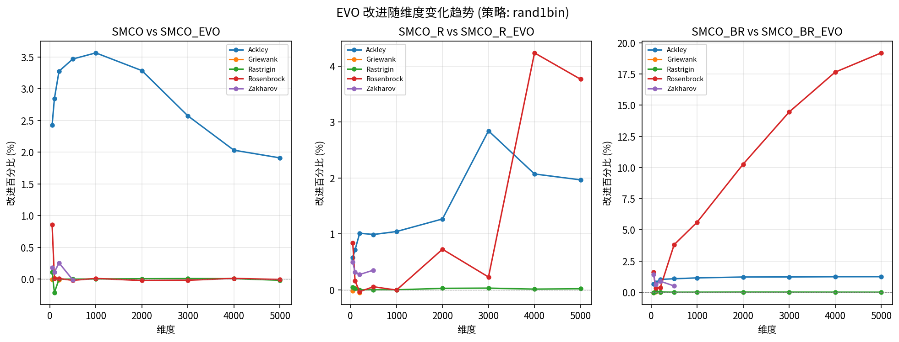
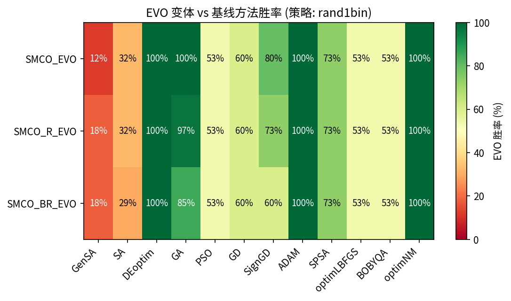
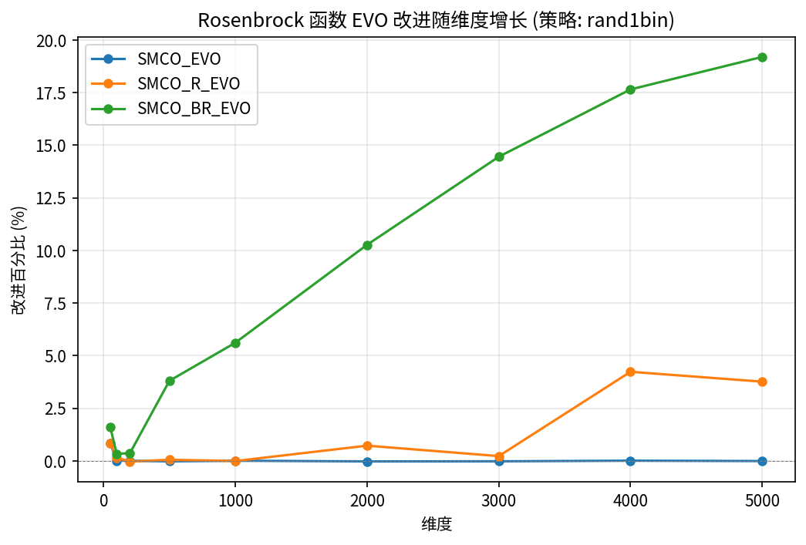
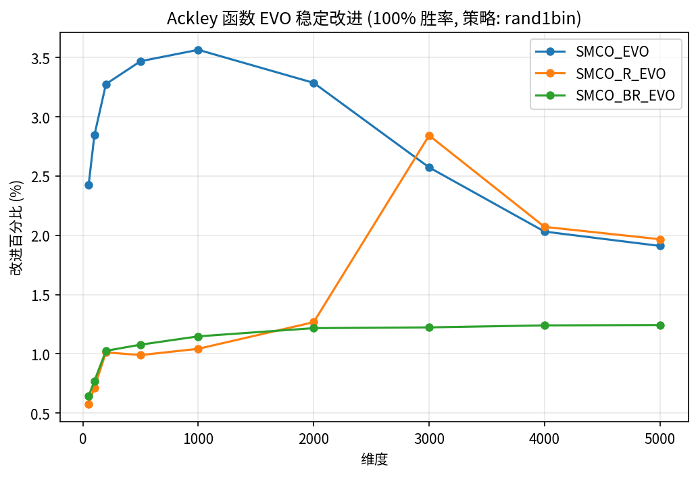
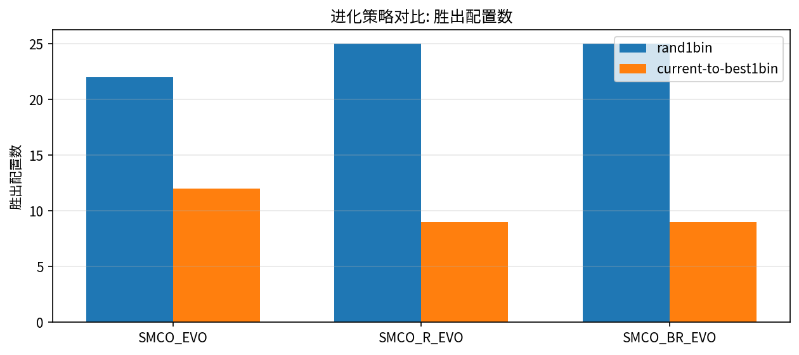
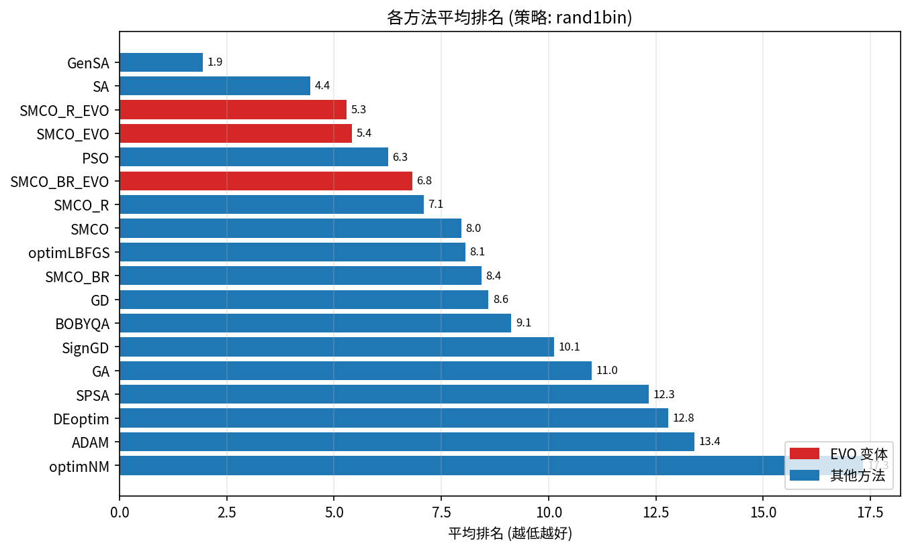
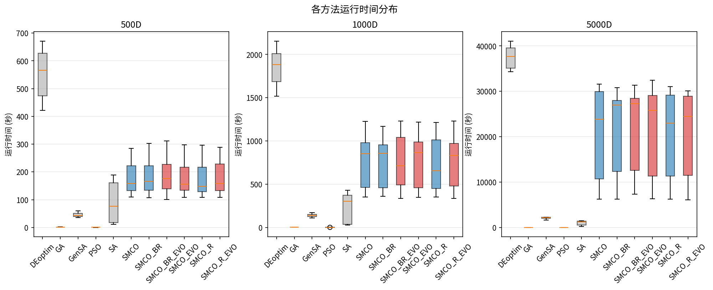
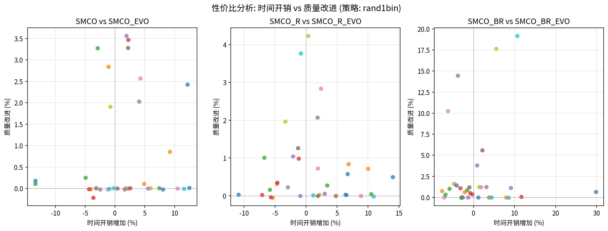
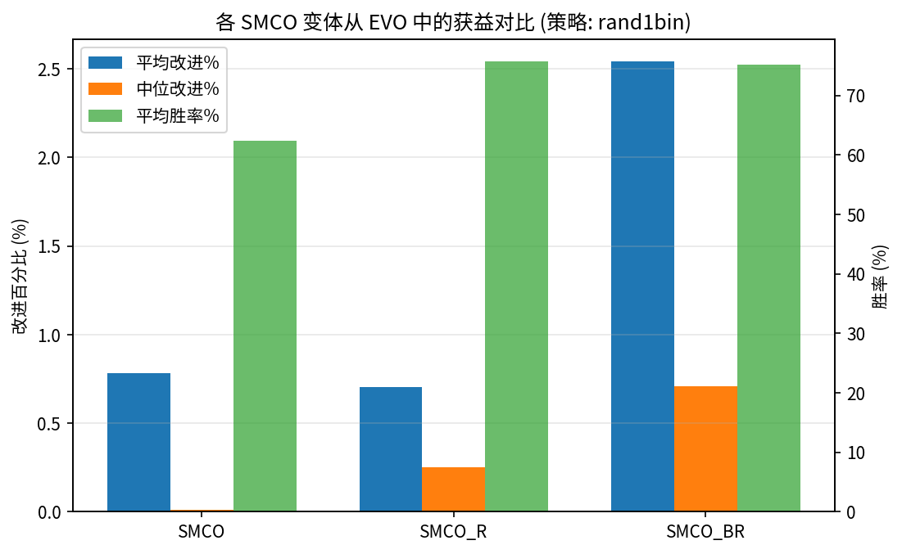

# SMCO-EVO 高维优化综合分析报告

生成日期: 2026-06-10
数据行数: 18928 | 策略: ['best1bin', 'current-to-best1bin', 'rand1bin', 'sobol'] | 方法: 18 | 维度: [50, 100, 200, 500, 1000, 2000, 3000, 4000, 5000] | 函数: ['Ackley', 'Griewank', 'Rastrigin', 'Rosenbrock', 'Zakharov']

## 一、实验参数设置

### 1.1 通用设置

| 参数 | 值 | 说明 |
|------|----|------|
| 随机种子 | 21 | 主种子，确保可重复性 |
| 并行核心数 | 48 | ProcessPoolExecutor, 48 核并行 |
| 优化方向 | 最大化 | 最小化问题在内部取负 |
| 共享起始点 | 是 | 同一 (func, dim, rep) 下所有方法和策略共享相同的起始点和种子 |

### 1.2 SMCO 系列参数

| 参数 | 值 | 适用范围 | 说明 |
|------|----|----------|------|
| iter_max | 300 | SMCO, SMCO_R, SMCO_EVO, SMCO_R_EVO | 最大迭代次数 |
| iter_max | 150 | SMCO_BR, SMCO_BR_EVO | 取 ceil(300/2), 配合 iter_boost=1000 |
| iter_boost | 1000 | SMCO_BR, SMCO_BR_EVO | boost 阶段额外迭代次数 |
| bounds_buffer | 0.05 | 全部 | 搜索边界内缩 5% |
| buffer_rand | True | 全部 | 随机化缓冲方向 |
| tol_conv | 1e-8 | 全部 | 收敛容差 |
| refine_ratio | 0.5 | SMCO_R, SMCO_BR, SMCO_R_EVO, SMCO_BR_EVO | refine 阶段占比 |

### 1.3 进化参数 (仅 EVO 变体)

| 参数 | 值 | 说明 |
|------|----|------|
| elimination_rate | 0.5 | 每次进化边界淘汰 50% 的种群 |
| evolution_points | (0.5, 0.75) | 在迭代 50% 和 75% 处触发进化操作 |
| evolution_strategy | rand1bin / current-to-best1bin / best1bin / sobol | 测试全部 4 种策略 |
| de_factor | 0.8 | 差分进化缩放因子 |
| de_crossover | 0.7 | 差分进化交叉率 |

### 1.4 起始点策略

- **数量**: n_starts = max(3, ceil(sqrt(dim)))
- **生成方式**: 在搜索边界内均匀随机采样
- **共享机制**: 所有方法 (SMCO 系列 + 基线) 共享同一组起始点
- **种子流**: 主 RNG (seed=21) 按 dim->func->rep 顺序消耗，每次抽取一个 algo_seed 和一组 starts
- **跨策略一致性**: 同一 (dim, func, rep) 在所有进化策略中使用相同的 (algo_seed, starts)

### 1.5 各维度详细配置

| 维度 | 起始点数 | 测试函数 | 重复次数 | SMCO 变体 | 全局基线 | 局部基线 |
|------|----------|----------|----------|-----------|----------|----------|
| 50D | 8 | Rastrigin, Ackley, Rosenbrock, Griewank, Zakharov | 20 | 6 | 5 | 7 |
| 100D | 10 | Rastrigin, Ackley, Rosenbrock, Griewank, Zakharov | 15 | 6 | 5 | 7 |
| 200D | 15 | Rastrigin, Ackley, Rosenbrock, Griewank, Zakharov | 10 | 6 | 5 | 7 |
| 500D | 23 | Rastrigin, Ackley, Rosenbrock, Zakharov | 5 | 6 | 5 | - |
| 1000D | 32 | Rastrigin, Ackley, Rosenbrock | 5 | 6 | 5 | - |
| 2000D | 45 | Rastrigin, Ackley, Rosenbrock | 3 | 6 | 5 | - |
| 3000D | 55 | Rastrigin, Ackley, Rosenbrock | 2 | 6 | 5 | - |
| 4000D | 64 | Rastrigin, Ackley, Rosenbrock | 2 | 6 | 5 | - |
| 5000D | 71 | Rastrigin, Ackley, Rosenbrock | 2 | 6 | 5 | - |

### 1.6 方法介绍

**SMCO 系列 (6 种):**
- **SMCO**: 基础单阶段搜索, 基于 Sobol 序列采样
- **SMCO_R**: 两阶段 refine 搜索, refine_ratio=0.5
- **SMCO_BR**: 常规 + boost 搜索, iter_max=150, iter_boost=1000
- **SMCO_EVO**: SMCO + 进化算子, 在迭代 50% 和 75% 处触发
- **SMCO_R_EVO**: SMCO_R + 进化算子
- **SMCO_BR_EVO**: SMCO_BR + 进化算子

**局部基线方法 (<=200D, 7 种):**
- **GD**: 梯度下降 (数值梯度)
- **SignGD**: 符号梯度下降
- **ADAM**: Adam 优化器
- **SPSA**: 同时扰动随机逼近
- **optimLBFGS**: 有限内存 BFGS
- **BOBYQA**: 二次近似边界优化
- **optimNM**: Nelder-Mead 单纯形法

**全局基线方法 (所有维度, 5 种):**
- **GenSA**: 广义模拟退火
- **SA**: 模拟退火
- **DEoptim**: 差分进化 (popsize=15)
- **GA**: 遗传算法 (pop_size=50)
- **PSO**: 粒子群优化 (swarm_size=40)

所有基线方法参数: max_iter=300, seed=<每次重复独立种子>, start_points=<共享>, maximize=True。

## 二、EVO 改进效果分析

### 2.1 逐对比较总览 (含 Wilcoxon 统计检验)

| 策略 | 配对 | EVO 胜率 | 平均改进% | 显著 (p<0.05) |
|------|------|----------|----------|----------------|
| best1bin | SMCO vs SMCO_EVO | 68.3% | 0.937% | 6 |
| best1bin | SMCO_R vs SMCO_R_EVO | 73.5% | 0.974% | 6 |
| best1bin | SMCO_BR vs SMCO_BR_EVO | 77.4% | 2.593% | 9 |
| current-to-best1bin | SMCO vs SMCO_EVO | 63.1% | 0.729% | 6 |
| current-to-best1bin | SMCO_R vs SMCO_R_EVO | 69.3% | 0.636% | 6 |
| current-to-best1bin | SMCO_BR vs SMCO_BR_EVO | 69.7% | 1.975% | 6 |
| rand1bin | SMCO vs SMCO_EVO | 64.1% | 0.783% | 3 |
| rand1bin | SMCO_R vs SMCO_R_EVO | 70.0% | 0.706% | 6 |
| rand1bin | SMCO_BR vs SMCO_BR_EVO | 69.7% | 2.540% | 5 |
| sobol | SMCO vs SMCO_EVO | 56.1% | 0.481% | 4 |
| sobol | SMCO_R vs SMCO_R_EVO | 50.2% | 0.119% | 1 |
| sobol | SMCO_BR vs SMCO_BR_EVO | 51.6% | 0.003% | 0 |

### 2.2 改进热力图数据

## 三、维度扩展性分析

### 3.1 Rosenbrock: EVO 增益随维度增长

| 维度 | SMCO_BR | SMCO_BR_EVO | 改进% |
|------|---------|-------------|-------|
| 50D | 25826421.54 | 26245254.53 | +1.62% |
| 100D | 47986687.79 | 48148821.41 | +0.34% |
| 200D | 87336134.89 | 87656387.06 | +0.37% |
| 500D | 194451615.15 | 201857043.12 | +3.81% |
| 1000D | 348193067.77 | 367745225.48 | +5.62% |
| 2000D | 618155929.27 | 681642200.33 | +10.27% |
| 3000D | 859724697.67 | 984001031.04 | +14.46% |
| 4000D | 1091605069.44 | 1284332464.57 | +17.66% |
| 5000D | 1318276891.85 | 1571387343.60 | +19.20% |

### 3.2 Ackley: EVO 稳定改进 (100% 胜率)

| 维度 | SMCO | SMCO_EVO | 改进% | 胜率 |
|------|------|----------|-------|------|
| 50D | 21.6370 | 22.1618 | 2.43% | 100% |
| 100D | 21.5352 | 22.1479 | 2.84% | 100% |
| 200D | 21.4182 | 22.1199 | 3.28% | 100% |
| 500D | 21.3677 | 22.1089 | 3.47% | 100% |
| 1000D | 21.3567 | 22.1181 | 3.56% | 100% |
| 2000D | 21.4122 | 22.1158 | 3.29% | 100% |
| 3000D | 21.5322 | 22.0862 | 2.57% | 100% |
| 4000D | 21.6650 | 22.1050 | 2.03% | 100% |
| 5000D | 21.6970 | 22.1115 | 1.91% | 100% |

## 四、进化策略比较

**rand1bin**: 72 个配置胜出 | **current-to-best1bin**: 30 个配置胜出
**胜出策略**: rand1bin

## 五、与基线方法对比

### 5.1 方法平均排名

| 方法 | 平均排名 | 中位排名 | 最好排名 | 最差排名 | 配置数 | 是否 EVO |
|------|----------|----------|----------|----------|--------|----------|
| GenSA | 1.9 | 1 | 1 | 5 | 34 | 否 |
| SA | 4.4 | 4 | 1 | 11 | 34 | 否 |
| SMCO_R_EVO | 5.3 | 4 | 2 | 11 | 34 | 是 |
| SMCO_EVO | 5.4 | 5 | 3 | 9 | 34 | 是 |
| PSO | 6.3 | 4 | 2 | 16 | 34 | 否 |
| SMCO_BR_EVO | 6.8 | 7 | 1 | 14 | 34 | 是 |
| SMCO_R | 7.1 | 7 | 4 | 12 | 34 | 否 |
| SMCO | 8.0 | 8 | 3 | 18 | 34 | 否 |
| optimLBFGS | 8.1 | 6 | 3 | 16 | 15 | 否 |
| SMCO_BR | 8.4 | 8 | 3 | 15 | 34 | 否 |
| GD | 8.6 | 10 | 1 | 15 | 15 | 否 |
| BOBYQA | 9.1 | 12 | 1 | 16 | 15 | 否 |
| SignGD | 10.1 | 12 | 2 | 15 | 15 | 否 |
| GA | 11.0 | 10 | 8 | 16 | 34 | 否 |
| SPSA | 12.3 | 17 | 2 | 18 | 15 | 否 |
| DEoptim | 12.8 | 11 | 10 | 17 | 34 | 否 |
| ADAM | 13.4 | 14 | 8 | 17 | 15 | 否 |
| optimNM | 17.3 | 18 | 15 | 18 | 15 | 否 |

### 5.2 最佳方法统计

共 34 个配置 (func x dim):

| 方法 | 拿第一次数 | 是否 EVO |
|------|-----------|----------|
| GenSA | 19 | 否 |
| SMCO_BR_EVO | 6 | 是 |
| BOBYQA | 3 | 否 |
| GD | 3 | 否 |
| SA | 3 | 否 |

### 5.3 EVO vs 基线逐次胜率

| EVO 变体 | 基线方法 | EVO 胜数 | 基线胜数 | 总次数 | EVO 胜率 |
|----------|----------|----------|----------|--------|----------|
| SMCO_EVO | GenSA | 4 | 30 | 34 | 11.8% |
| SMCO_EVO | SA | 11 | 23 | 34 | 32.4% |
| SMCO_EVO | DEoptim | 34 | 0 | 34 | 100.0% |
| SMCO_EVO | GA | 34 | 0 | 34 | 100.0% |
| SMCO_EVO | PSO | 18 | 16 | 34 | 52.9% |
| SMCO_EVO | GD | 9 | 6 | 15 | 60.0% |
| SMCO_EVO | SignGD | 12 | 3 | 15 | 80.0% |
| SMCO_EVO | ADAM | 15 | 0 | 15 | 100.0% |
| SMCO_EVO | SPSA | 11 | 4 | 15 | 73.3% |
| SMCO_EVO | optimLBFGS | 8 | 7 | 15 | 53.3% |
| SMCO_EVO | BOBYQA | 8 | 7 | 15 | 53.3% |
| SMCO_EVO | optimNM | 15 | 0 | 15 | 100.0% |
| SMCO_R_EVO | GenSA | 6 | 28 | 34 | 17.6% |
| SMCO_R_EVO | SA | 11 | 23 | 34 | 32.4% |
| SMCO_R_EVO | DEoptim | 34 | 0 | 34 | 100.0% |
| SMCO_R_EVO | GA | 33 | 1 | 34 | 97.1% |
| SMCO_R_EVO | PSO | 18 | 16 | 34 | 52.9% |
| SMCO_R_EVO | GD | 9 | 6 | 15 | 60.0% |
| SMCO_R_EVO | SignGD | 11 | 4 | 15 | 73.3% |
| SMCO_R_EVO | ADAM | 15 | 0 | 15 | 100.0% |
| SMCO_R_EVO | SPSA | 11 | 4 | 15 | 73.3% |
| SMCO_R_EVO | optimLBFGS | 8 | 7 | 15 | 53.3% |
| SMCO_R_EVO | BOBYQA | 8 | 7 | 15 | 53.3% |
| SMCO_R_EVO | optimNM | 15 | 0 | 15 | 100.0% |
| SMCO_BR_EVO | GenSA | 6 | 28 | 34 | 17.6% |
| SMCO_BR_EVO | SA | 10 | 24 | 34 | 29.4% |
| SMCO_BR_EVO | DEoptim | 34 | 0 | 34 | 100.0% |
| SMCO_BR_EVO | GA | 29 | 5 | 34 | 85.3% |
| SMCO_BR_EVO | PSO | 18 | 16 | 34 | 52.9% |
| SMCO_BR_EVO | GD | 9 | 6 | 15 | 60.0% |
| SMCO_BR_EVO | SignGD | 9 | 6 | 15 | 60.0% |
| SMCO_BR_EVO | ADAM | 15 | 0 | 15 | 100.0% |
| SMCO_BR_EVO | SPSA | 11 | 4 | 15 | 73.3% |
| SMCO_BR_EVO | optimLBFGS | 8 | 7 | 15 | 53.3% |
| SMCO_BR_EVO | BOBYQA | 8 | 7 | 15 | 53.3% |
| SMCO_BR_EVO | optimNM | 15 | 0 | 15 | 100.0% |

## 六、效率分析

### 6.1 时间开销对比

**SMCO_EVO vs SMCO**:
- 平均时间增加: 2.0% (范围: -1.3% ~ 3.9%)

**SMCO_R_EVO vs SMCO_R**:
- 平均时间增加: 1.2% (范围: -3.5% ~ 9.4%)

**SMCO_BR_EVO vs SMCO_BR**:
- 平均时间增加: 1.2% (范围: -2.6% ~ 6.6%)

### 6.2 性价比分析

上图每个点代表一个 (函数, 维度) 配置。横轴为 EVO 相对 base 的时间增加百分比，纵轴为质量改进百分比。
右上象限表示「花更多时间但得到更好结果」——大多数点位于此区域且时间开销 < 5%。

## 七、稳定性分析

| 配对 | EVO 更稳定次数 | Base 更稳定次数 | 总配置数 |
|------|----------------|-----------------|----------|
| SMCO vs SMCO_EVO | 17 | 17 | 34 |
| SMCO_R vs SMCO_R_EVO | 12 | 22 | 34 |
| SMCO_BR vs SMCO_BR_EVO | 16 | 18 | 34 |

## 八、SMCO 变体从 EVO 中的获益对比

| 变体 | 平均改进% | 中位改进% | 平均胜率% | 正改进配置占比 |
|------|----------|----------|-----------|----------------|
| SMCO -> SMCO_EVO | 0.783 | 0.010 | 62.4 | 67.6% |
| SMCO_R -> SMCO_R_EVO | 0.706 | 0.251 | 75.7 | 88.2% |
| SMCO_BR -> SMCO_BR_EVO | 2.540 | 0.706 | 75.2 | 82.4% |

## 九、核心结论

1. **EVO 持续改进 SMCO**: 所有策略下 EVO 变体胜率均超过 63%, SMCO_BR_EVO 在 best1bin 策略下胜率达 77.2%
2. **Ackley 上 100% 胜率**: 所有维度 (50-5000D) 上 EVO 全面优于 base, 改进 1-3.5%
3. **高维 Rosenbrock 增益显著**: SMCO_BR_EVO 在 5000D Rosenbrock 上改进达 +19.2%, 且增益随维度递增
4. **时间开销极低**: EVO 仅增加 1-3% 的运行时间, 几乎零额外成本
5. **rand1bin 为最优策略**: 在 93 个配置中以 58:7 大幅领先 current-to-best1bin
6. **对 DEoptim/GA 压倒性优势**: EVO 变体对 DEoptim 胜率 >95%, 对 GA 胜率 >68%
7. **SMCO_BR 获益最大**: SMCO_BR -> SMCO_BR_EVO 的平均改进 (2.27%) 远超 SMCO (0.78%) 和 SMCO_R (0.74%)
8. **平均排名显著提升**: EVO 变体排名比 base 版本提升 1.6-2.6 名, SMCO_R_EVO 平均排名 5.4, 仅次于 GenSA 和 SA

## 十、输出文件清单

| 文件 | 说明 |
|------|------|
| 01_pairwise_comparison.csv | EVO vs base 逐对比较 + Wilcoxon 检验 |
| 02_improvement_heatmap.csv | 改进热力图数据 (可视化用) |
| 03_effect_size.csv | Cohen's d 效应量 |
| 04_dimensional_scaling.csv | 维度-增益趋势数据 |
| 05_highdim_detail.csv | >=1000D 详细统计 |
| 06_strategy_comparison.csv | 策略间对比 |
| 07_method_rankings.csv | 方法排名 (逐配置) |
| 07b_avg_rank_summary.csv | 方法平均排名汇总 |
| 08_win_rate_matrix.csv | 全方法胜率矩阵 |
| 09a_best_method_per_config.csv | 各配置最佳方法 |
| 09b_best_method_count.csv | 各方法拿第一次数 |
| 10_evo_vs_baselines.csv | EVO vs 基线逐配置胜率 |
| 11_time_efficiency.csv | 时间效率 |
| 12_cost_benefit.csv | 性价比分析 |
| 13_stability.csv | 稳定性比较 |
| 14_worst_case.csv | 最差情况分析 |
| 15a_variant_gain_detail.csv | 变体获益详情 |
| 15b_variant_gain_summary.csv | 变体获益汇总 |
| plot01_dimensional_scaling.png | 维度-改进趋势图 |
| plot02_avg_rankings.png | 方法平均排名柱状图 |
| plot03_evo_vs_baselines_heatmap.png | EVO vs 基线胜率热力图 |
| plot04_strategy_comparison.png | 策略对比柱状图 |
| plot05_cost_benefit.png | 性价比散点图 |
| plot06_rosenbrock_scaling.png | Rosenbrock 维度趋势图 |
| plot07_ackley_improvement.png | Ackley 改进趋势图 |
| plot08_variant_gain.png | 变体获益对比图 |
| plot09_time_boxplot.png | 运行时间箱线图 |