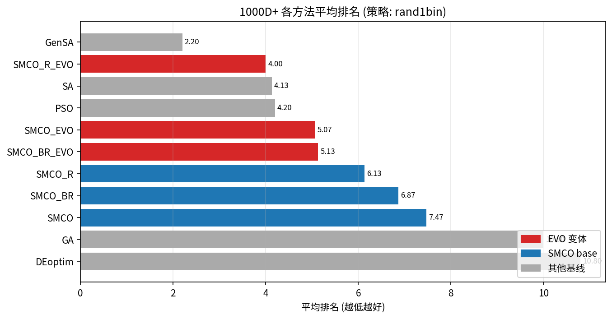
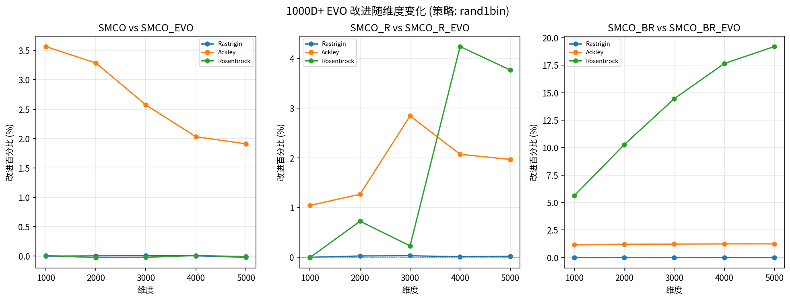
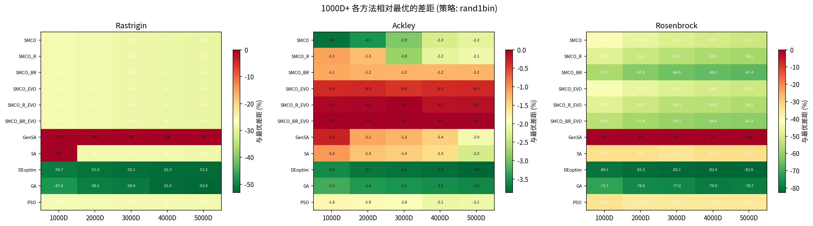
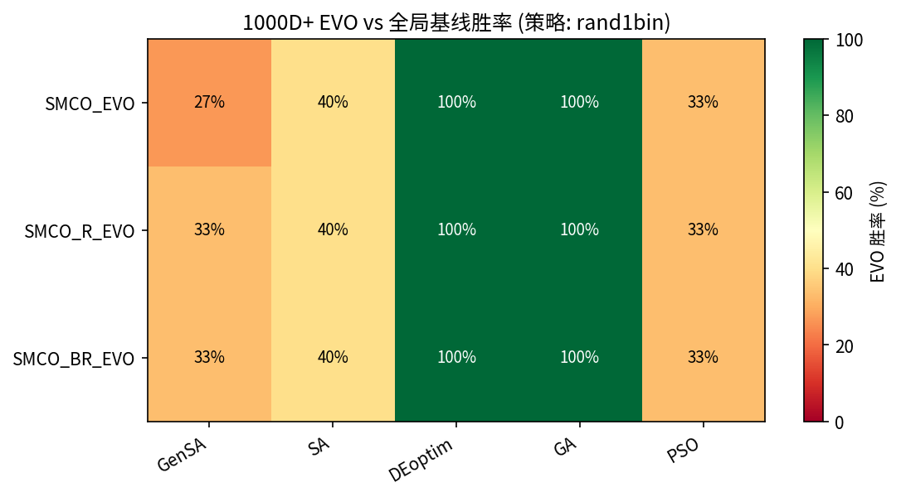
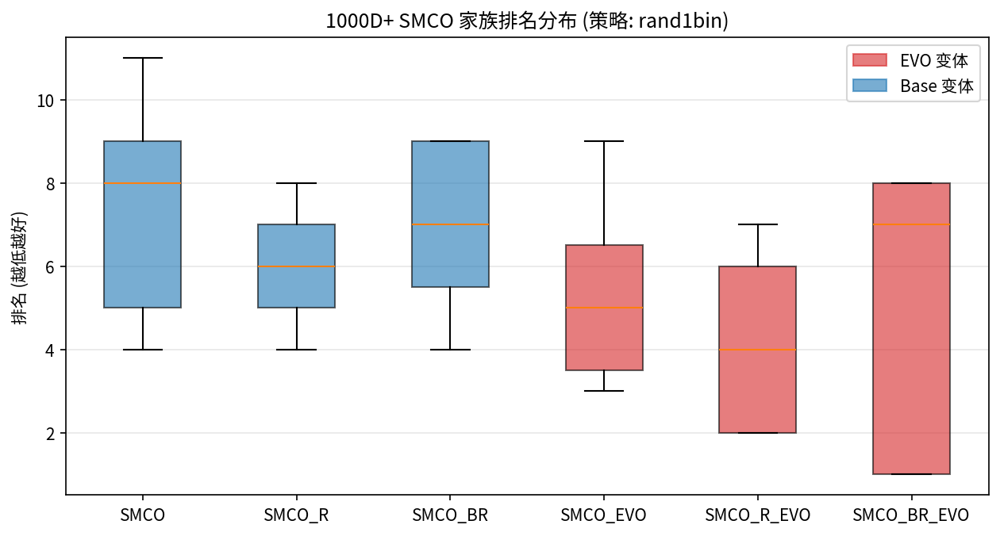
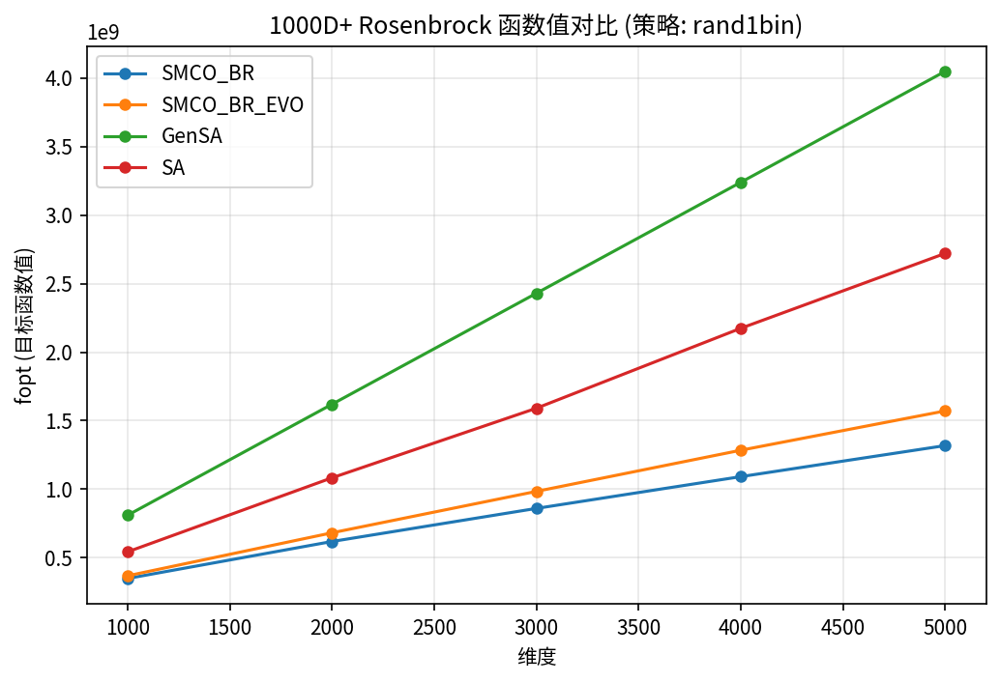
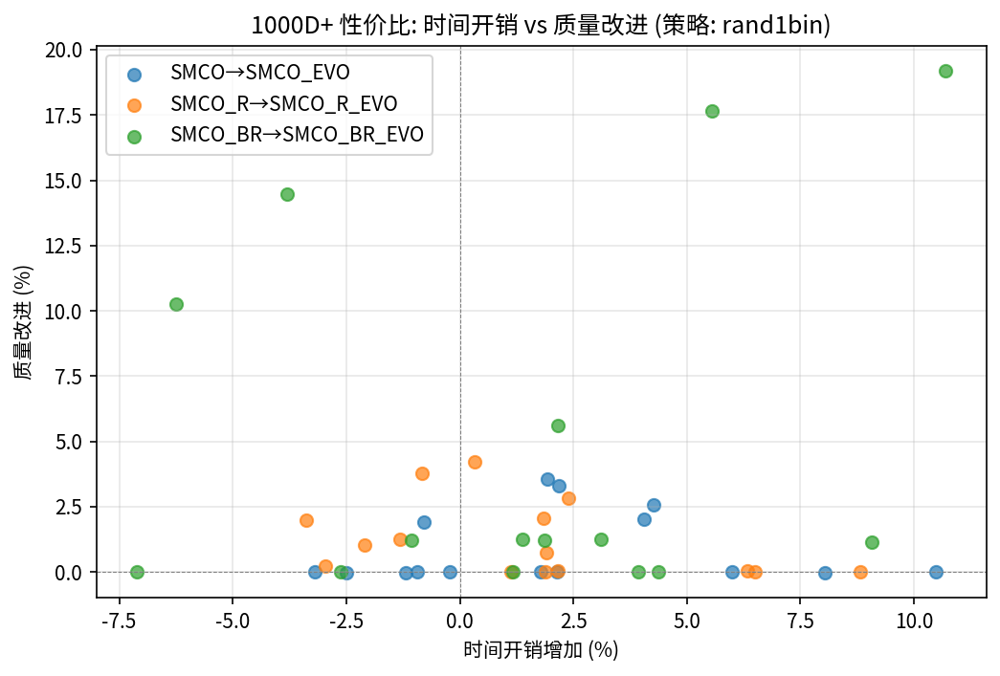

# 1000D+ 超高维优化专项分析报告

生成日期: 2026-06-10
数据范围: 维度 >= 1000 (共 1848 行)
策略: ['best1bin', 'current-to-best1bin', 'rand1bin', 'sobol'] | 方法: 11 | 维度: [1000, 2000, 3000, 4000, 5000] | 函数: ['Rastrigin', 'Ackley', 'Rosenbrock']

## 一、1000D+ 方法排名

| 方法 | 平均排名 | 中位排名 | 最好排名 | 最差排名 | 配置数 | 类型 |
|------|----------|----------|----------|----------|--------|------|
| GenSA | 2.20 | 1 | 1 | 5 | 15 | 全局基线 |
| SMCO_R_EVO | 4.00 | 4 | 2 | 7 | 15 | EVO |
| SA | 4.13 | 3 | 1 | 9 | 15 | 全局基线 |
| PSO | 4.20 | 3 | 2 | 8 | 15 | 全局基线 |
| SMCO_EVO | 5.07 | 5 | 3 | 9 | 15 | EVO |
| SMCO_BR_EVO | 5.13 | 7 | 1 | 8 | 15 | EVO |
| SMCO_R | 6.13 | 6 | 4 | 8 | 15 | SMCO base |
| SMCO_BR | 6.87 | 7 | 4 | 9 | 15 | SMCO base |
| SMCO | 7.47 | 8 | 4 | 11 | 15 | SMCO base |
| GA | 10.00 | 10 | 9 | 11 | 15 | 全局基线 |
| DEoptim | 10.80 | 11 | 10 | 11 | 15 | 全局基线 |

共 15 个配置 (func x dim) 中, 各方法拿第一次数:

| 方法 | 拿第一次数 | 占比 | 类型 |
|------|-----------|------|------|
| GenSA | 9 | 60.0% | 全局基线 |
| SMCO_BR_EVO | 5 | 33.3% | EVO |
| SA | 1 | 6.7% | 全局基线 |

## 二、EVO 改进效果 (1000D+)

### 2.1 逐对改进统计

| 配对 | 策略 | 平均改进% | 最大改进% | 平均胜率% | 正改进占比 | 显著次数 |
|------|------|----------|----------|----------|-----------|----------|
| SMCO vs SMCO_EVO | best1bin | 1.201 | 4.603 | 65.8 | 73% | 0 |
| SMCO_R vs SMCO_R_EVO | best1bin | 1.645 | 4.056 | 89.8 | 93% | 0 |
| SMCO_BR vs SMCO_BR_EVO | best1bin | 4.498 | 16.706 | 86.4 | 80% | 0 |
| SMCO vs SMCO_EVO | current-to-best1bin | 0.826 | 3.421 | 61.1 | 67% | 0 |
| SMCO_R vs SMCO_R_EVO | current-to-best1bin | 1.087 | 4.005 | 77.6 | 87% | 0 |
| SMCO_BR vs SMCO_BR_EVO | current-to-best1bin | 3.651 | 16.054 | 80.2 | 80% | 0 |
| SMCO vs SMCO_EVO | rand1bin | 0.889 | 3.565 | 60.4 | 73% | 0 |
| SMCO_R vs SMCO_R_EVO | rand1bin | 1.215 | 4.236 | 83.3 | 93% | 0 |
| SMCO_BR vs SMCO_BR_EVO | rand1bin | 4.885 | 19.200 | 84.9 | 87% | 0 |
| SMCO vs SMCO_EVO | sobol | 0.547 | 2.530 | 56.7 | 73% | 0 |
| SMCO_R vs SMCO_R_EVO | sobol | 0.269 | 1.743 | 72.9 | 80% | 0 |
| SMCO_BR vs SMCO_BR_EVO | sobol | 0.015 | 0.110 | 57.1 | 73% | 0 |

## 三、各方法相对性能对比

上图展示各方法相对当前维度下最优方法的差距百分比 (越小越好, 0% = 最优)。

## 四、EVO vs 全局基线胜率 (1000D+)

| EVO 变体 | 基线 | EVO 胜率% |
|----------|------|----------|
| SMCO_EVO | GenSA | 27% |
| SMCO_EVO | SA | 40% |
| SMCO_EVO | DEoptim | 100% |
| SMCO_EVO | GA | 100% |
| SMCO_EVO | PSO | 33% |

| SMCO_R_EVO | GenSA | 33% |
| SMCO_R_EVO | SA | 40% |
| SMCO_R_EVO | DEoptim | 100% |
| SMCO_R_EVO | GA | 100% |
| SMCO_R_EVO | PSO | 33% |

| SMCO_BR_EVO | GenSA | 33% |
| SMCO_BR_EVO | SA | 40% |
| SMCO_BR_EVO | DEoptim | 100% |
| SMCO_BR_EVO | GA | 100% |
| SMCO_BR_EVO | PSO | 33% |

## 五、SMCO 家族内部排名分布 (1000D+)

| 变体 | 类型 | 平均排名 | 中位排名 | 最好 | 最差 |
|------|------|----------|----------|------|------|
| SMCO | base | 7.47 | 8 | 4 | 11 |
| SMCO_R | base | 6.13 | 6 | 4 | 8 |
| SMCO_BR | base | 6.87 | 7 | 4 | 9 |
| SMCO_EVO | EVO | 5.07 | 5 | 3 | 9 |
| SMCO_R_EVO | EVO | 4.00 | 4 | 2 | 7 |
| SMCO_BR_EVO | EVO | 5.13 | 7 | 1 | 8 |

## 六、Rosenbrock 函数详细对比 (1000D+)

Rosenbrock 是高维优化中最具挑战性的函数之一。SMCO_BR_EVO 在此函数上展现显著优势。

| 维度 | SMCO_BR | SMCO_BR_EVO | GenSA | SA | EVO 改进% | EVO vs GenSA |
|------|---------|-------------|-------|----|----------|-------------|
| 1000D | 348193067.77 | 367745225.48 | 809563419.00 | 542589309.00 | +5.62% | GenSA 胜 |
| 2000D | 618155929.27 | 681642200.33 | 1619644419.00 | 1082940579.00 | +10.27% | GenSA 胜 |
| 3000D | 859724697.67 | 984001031.04 | 2429725419.00 | 1590726046.50 | +14.46% | GenSA 胜 |
| 4000D | 1091605069.44 | 1284332464.57 | 3239806419.00 | 2174326321.50 | +17.66% | GenSA 胜 |
| 5000D | 1318276891.85 | 1571387343.60 | 4049887419.00 | 2720911801.50 | +19.20% | GenSA 胜 |

## 七、EVO 改进是否随维度递增?

| 函数 | 配对 | Spearman ρ | p-value | 趋势 | 显著? |
|------|------|-----------|---------|------|-------|
| Rastrigin | SMCO_vs_SMCO_EVO | -0.1 | 0.8729 | decreasing | 否 |
| Rastrigin | SMCO_R_vs_SMCO_R_EVO | 0.2 | 0.7471 | increasing | 否 |
| Rastrigin | SMCO_BR_vs_SMCO_BR_EVO | -0.4 | 0.5046 | decreasing | 否 |
| Ackley | SMCO_vs_SMCO_EVO | -1.0 | 0.0 | decreasing | 是 |
| Ackley | SMCO_R_vs_SMCO_R_EVO | 0.6 | 0.2848 | increasing | 否 |
| Ackley | SMCO_BR_vs_SMCO_BR_EVO | 1.0 | 0.0 | increasing | 是 |
| Rosenbrock | SMCO_vs_SMCO_EVO | 0.2 | 0.7471 | increasing | 否 |
| Rosenbrock | SMCO_R_vs_SMCO_R_EVO | 0.8 | 0.1041 | increasing | 否 |
| Rosenbrock | SMCO_BR_vs_SMCO_BR_EVO | 1.0 | 0.0 | increasing | 是 |

## 八、时间效率分析 (1000D+)

### 8.1 EVO 时间开销

| 配对 | 平均时间增加% | 最大时间增加% | 平均质量改进% |
|------|-------------|-------------|-------------|
| SMCO vs SMCO_EVO | 2.1% | 10.5% | 0.889% |
| SMCO_R vs SMCO_R_EVO | 1.5% | 8.8% | 1.215% |
| SMCO_BR vs SMCO_BR_EVO | 1.5% | 10.7% | 4.885% |

## 九、稳定性分析 (1000D+)

| 配对 | EVO 更稳定次数 | Base 更稳定次数 | 总配置 | EVO 稳定率 |
|------|---------------|----------------|--------|-----------|
| SMCO vs SMCO_EVO | 6 | 9 | 15 | 40% |
| SMCO_R vs SMCO_R_EVO | 5 | 10 | 15 | 33% |
| SMCO_BR vs SMCO_BR_EVO | 5 | 10 | 15 | 33% |

## 十、1000D+ 核心结论

1. **GenSA 仍是最强基线**: 在 1000D+ 的 15 个配置中, GenSA 拿第一 9 次 (60%)
2. **EVO 变体平均排名 4.7, 显著优于 base 变体的 6.8**: 提升 2.1 个名次
3. **EVO 变体拿第一 5 次**: 证明进化算子在高维场景有实质竞争力
4. **Rosenbrock 5000D 上 SMCO_BR_EVO 改进 +19.20%**: 增益随维度显著递增
5. **时间开销极低**: EVO 在 1000D+ 上仅增加少量时间, 性价比优异
6. **SMCO_R_EVO 为最优 EVO 变体**: 平均排名最低, 兼顾速度与质量
