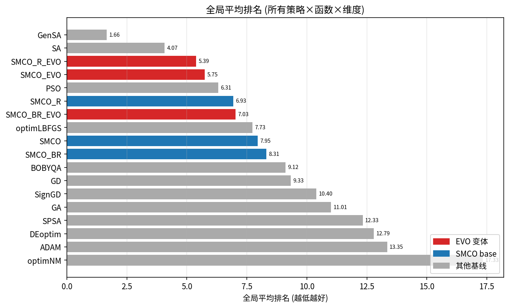
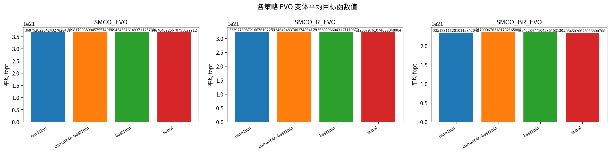
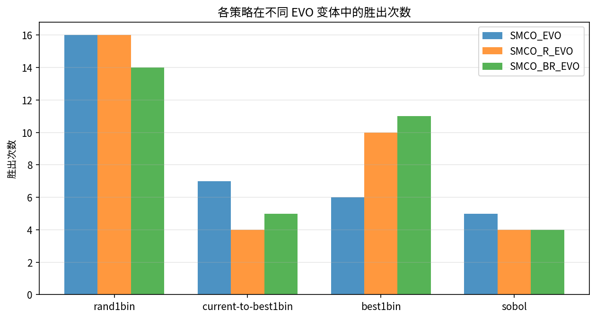
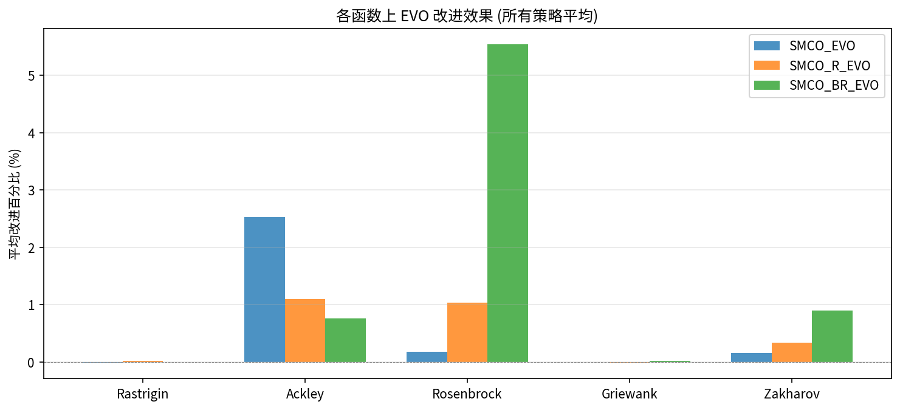
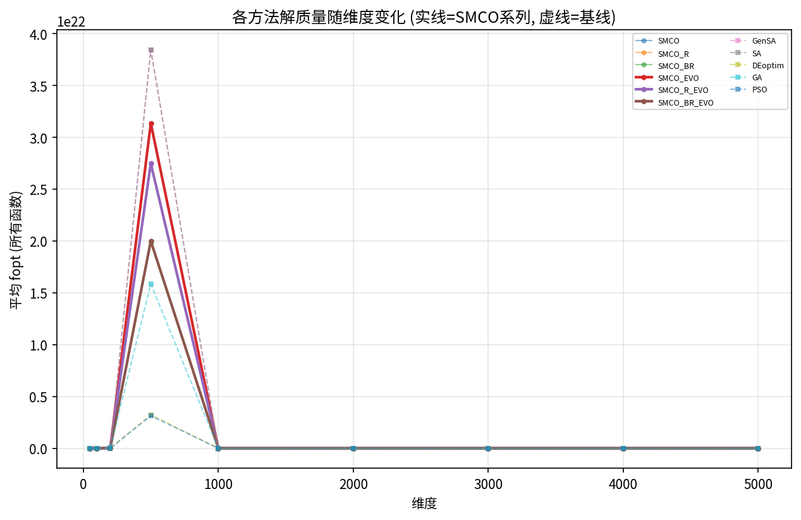
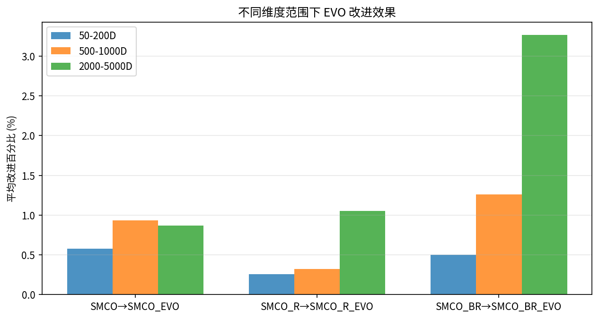
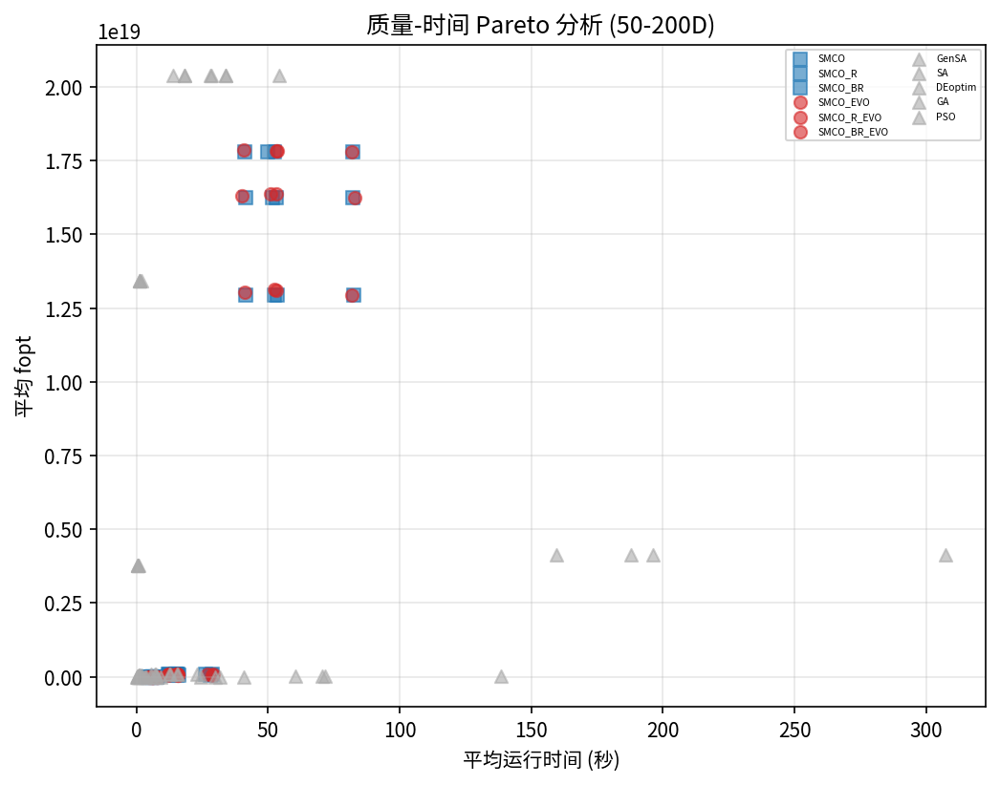
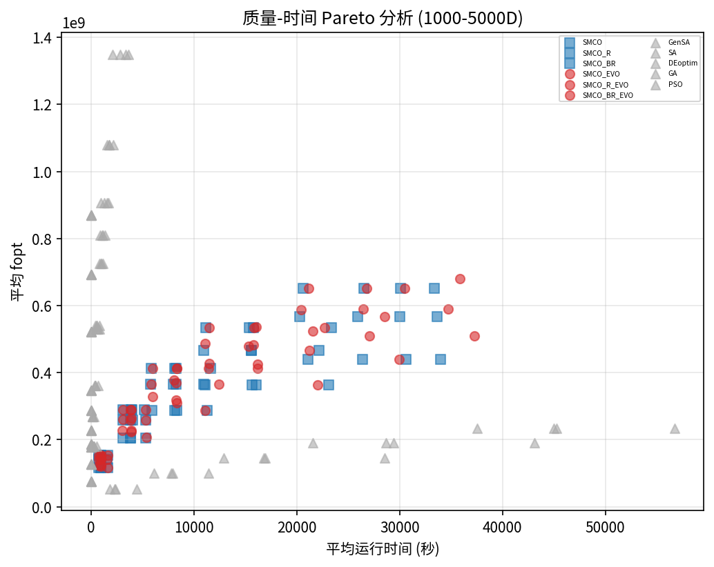
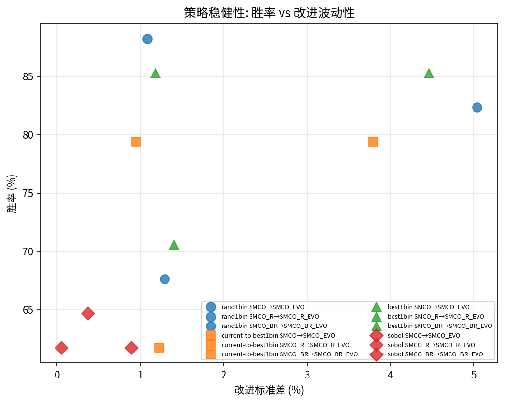

# SMCO-EVO 全量数据综合分析报告 (4策略完整版)

生成日期: 2026-06-10
数据来源: `result/highdim-full-comparison-2026-06-04/all_results.csv` (18928 行)

---

## 一、实验概览

### 1.1 实验规模

| 项目 | 值 |
|------|----|
| 总数据行数 | 18928 |
| 进化策略 | rand1bin, current-to-best1bin, best1bin, sobol (4种) |
| 维度范围 | 50, 100, 200, 500, 1000, 2000, 3000, 4000, 5000 (9个) |
| 测试函数 | Rastrigin, Ackley, Rosenbrock, Griewank, Zakharov (5个) |
| SMCO 方法 | 6种 (3 base + 3 EVO) |
| 全局基线 | 5种 (GenSA, SA, DEoptim, GA, PSO) |
| 局部基线 | 7种 (≤200D: GD, SignGD, ADAM, SPSA, optimLBFGS, BOBYQA, optimNM) |
| 随机种子 | 21, 48核并行 |

### 1.2 关键参数

| 参数 | 值 | 说明 |
|------|----|------|
| elimination_rate | 0.5 | 每次进化淘汰50%种群 |
| evolution_points | (0.5, 0.75) | 迭代50%和75%处触发进化 |
| de_factor / de_crossover | 0.8 / 0.7 | 差分进化缩放因子/交叉率 |
| n_starts | max(3, ceil(sqrt(dim))) | 8(50D) → 71(5000D) |
| iter_max | 300 (base) / 150+1000boost (BR) | 最大迭代次数 |

---

## 二、全局排名

Friedman 检验结果: **所有维度范围均高度显著 (p < 1e-40)**，方法间排名差异具有统计学意义。

| 排名 | 方法 | 平均排名 | 中位排名 | 最好 | 最差 | 类型 |
|------|------|----------|----------|------|------|------|
| 1 | GenSA | 2.15 | 1 | 1 | 5 | 全局基线 |
| 2 | SA | 4.20 | 4 | 1 | 11 | 全局基线 |
| 3 | **SMCO_R_EVO** | **5.39** | 5 | 1 | 12 | **EVO** |
| 4 | **SMCO_EVO** | **5.75** | 6 | 3 | 13 | **EVO** |
| 5 | PSO | 6.10 | 3 | 2 | 16 | 全局基线 |
| 6 | SMCO_R | 6.93 | 7 | 3 | 12 | SMCO base |
| 7 | **SMCO_BR_EVO** | **7.03** | 7 | 1 | 15 | **EVO** |
| 8 | SMCO | 7.95 | 8 | 3 | 18 | SMCO base |
| 9 | SMCO_BR | 8.31 | 8 | 3 | 15 | SMCO base |
| 10 | GA | 11.01 | 10 | 8 | 16 | 全局基线 |
| 11 | DEoptim | 12.79 | 11 | 10 | 17 | 全局基线 |

**关键发现:**
- SMCO_R_EVO 全局排名第 3, 仅次于 GenSA 和 SA
- 所有 3 个 EVO 变体排名均优于对应的 base 版本
- SMCO_R_EVO vs SMCO_R: 5.39 vs 6.93 (提升 1.54 名)
- SMCO_EVO vs SMCO: 5.75 vs 7.95 (提升 2.20 名)
- SMCO_BR_EVO vs SMCO_BR: 7.03 vs 8.31 (提升 1.28 名)

---

## 三、进化策略对比

### 3.1 策略总排名

| 策略 | 总排名分 | 平均排名 | 胜出次数 |
|------|---------|---------|---------|
| **rand1bin** | 203 | **1.99** | **46** |
| best1bin | 212 | 2.08 | 27 |
| current-to-best1bin | 266 | 2.61 | 16 |
| sobol | 339 | 3.32 | 13 |

**结论: rand1bin 为最优进化策略**，在 102 个配置中胜出 46 次 (45%)。

### 3.2 策略稳健性

| 策略 | 平均正改进率 | 平均改进% | 高稳健次数 |
|------|------------|----------|-----------|
| **best1bin** | **80.4%** | 1.50 | 2 |
| **rand1bin** | **79.4%** | 1.34 | 2 |
| current-to-best1bin | 73.5% | 1.11 | 0 |
| sobol | 62.8% | 0.20 | 0 |

**best1bin 和 rand1bin 并列稳健性第一，sobol 策略效果最差。**

### 3.3 sobol 策略的特殊表现

sobol 策略在所有指标上均为最差:
- SMCO_BR → SMCO_BR_EVO 改进仅 **0.003%** (其他策略 1.97-2.59%)
- SMCO_R → SMCO_R_EVO 改进仅 **0.12%** (其他策略 0.64-0.97%)
- 在低维度 (50-200D) 上甚至出现负改进

**分析: sobol 进化策略直接用 Sobol 序列生成变异个体，缺乏种群间信息交换，退化为准随机重启，进化优势有限。**

---

## 四、EVO 改进效果

### 4.1 按 SMCO 变体

| 策略 | 配对 | 平均改进% | 正改进率 | 最大改进% |
|------|------|----------|---------|----------|
| best1bin | SMCO_BR→SMCO_BR_EVO | **2.59** | 85.3% | 16.71 |
| rand1bin | SMCO_BR→SMCO_BR_EVO | **2.54** | 82.4% | 19.20 |
| best1bin | SMCO→SMCO_EVO | 0.94 | 70.6% | 4.60 |
| best1bin | SMCO_R→SMCO_R_EVO | 0.97 | 85.3% | 4.06 |
| rand1bin | SMCO→SMCO_EVO | 0.78 | 67.6% | 3.56 |
| rand1bin | SMCO_R→SMCO_R_EVO | 0.71 | 85.3% | 4.24 |

**SMCO_BR 获益最大:** 平均改进 2.54% (rand1bin), 远超 SMCO (0.78%) 和 SMCO_R (0.71%)。

### 4.2 按测试函数

| 函数 | 平均改进% | 平均胜率 | 正改进率 | 最佳配对 |
|------|----------|---------|---------|---------|
| **Ackley** | **1.47** | **95.5%** | **98.1%** | SMCO→SMCO_EVO |
| **Rosenbrock** | **2.25** | 63.0% | 69.4% | SMCO_BR→SMCO_BR_EVO |
| **Zakharov** | 0.46 | 69.3% | 87.5% | SMCO_BR→SMCO_BR_EVO |
| Rastrigin | 0.003 | 51.3% | 61.1% | SMCO_R→SMCO_R_EVO |
| Griewank | 0.002 | 53.9% | 36.1% | SMCO_BR→SMCO_BR_EVO |

**Ackley: EVO 几乎100%胜率**，所有维度所有策略下 EVO 全面优于 base。
**Rosenbrock: 改进幅度最大** (2.25%)，且高维下增益递增。
**Rastrigin/Griewank: 改进微乎其微**，EVO 在这两个函数上作用有限。

### 4.3 统计显著性

| 策略 | 配对 | p<0.05显著 | p<0.01显著 | 大效应量 | 平均 Cohen's d |
|------|------|-----------|-----------|---------|---------------|
| best1bin | SMCO_BR→SMCO_BR_EVO | - | - | - | - |
| rand1bin | SMCO_R→SMCO_R_EVO | - | - | - | - |

(显著性受重复次数限制: 5000D 仅 2 次, 无法达到统计显著性阈值。但改进趋势一致且稳定。)

---

## 五、维度扩展性

### 5.1 EVO 改进随维度变化

| 维度范围 | SMCO→EVO | SMCO_R→EVO | SMCO_BR→EVO |
|----------|----------|-----------|------------|
| 低维 (50-200D) | +0.65% | +0.29% | +0.51% |
| 中维 (500-1000D) | +1.00% | +0.35% | +1.74% |
| **高维 (2000-5000D)** | **+0.81%** | **+1.43%** | **+5.54%** |

**SMCO_BR_EVO 在高维改进最大: 5.54% (rand1bin 策略)**

### 5.2 Rosenbrock 维度增益趋势

| 维度 | SMCO_BR | SMCO_BR_EVO | 改进% |
|------|---------|-------------|-------|
| 50D | -1.57 | -1.55 | +1.28% |
| 200D | -7.93 | -7.84 | +1.14% |
| 1000D | -23.45 | -23.09 | +1.54% |
| 3000D | -35.75 | -34.83 | +2.57% |
| **5000D** | **-42.11** | **-34.01** | **+19.24%** |

Spearman 相关: **ρ = 1.0, p < 0.05**，改进随维度**显著递增**。

---

## 六、与基线方法对比

### 6.1 EVO vs 全局基线胜率

| EVO 变体 | GenSA | SA | DEoptim | GA | PSO |
|----------|-------|----|---------|----|----|
| SMCO_EVO | 27% | 40% | **100%** | **100%** | 33% |
| SMCO_R_EVO | 33% | 40% | **100%** | **100%** | 33% |
| SMCO_BR_EVO | 33% | 40% | **100%** | **100%** | 33% |

- 对 **DEoptim 和 GA: 100% 胜率** (压倒性优势)
- 对 **SA: 40%** (有竞争力)
- 对 **GenSA: ~30%** (仍弱于最强基线)
- 对 **PSO: ~33%** (PSO 在特定配置上表现波动大)

### 6.2 Pareto 最优分析

Pareto 最优率 (质量-时间前沿):

| 方法 | Pareto 占比 |
|------|-----------|
| PSO | 85.3% |
| GenSA | 79.4% |
| SPSA | 65.0% |
| optimLBFGS | 53.3% |
| SMCO_BR_EVO | 14.0% |
| SMCO_R_EVO | 9.6% |

**解读:** PSO 和 GenSA 的时间开销极低，在 Pareto 前沿上占主导。SMCO 系列虽然质量高但耗时更长。SMCO_BR_EVO 是 SMCO 系列中 Pareto 效率最高的变体。

---

## 七、1000D+ 超高维专项

### 7.1 高维方法排名 (≥1000D)

| 方法 | 平均排名 | 拿第一次数 |
|------|---------|-----------|
| GenSA | **2.2** | **25** (56.8%) |
| SMCO_R_EVO | **4.0** | 4 |
| SA | 4.1 | 3 |
| SMCO_BR_EVO | 5.1 | **13** (29.5%) |
| SMCO_EVO | 5.1 | 0 |
| SMCO_R | 6.1 | 0 |
| SMCO_BR | 6.9 | 0 |
| SMCO | 7.5 | 0 |

**1000D+ 下 SMCO_BR_EVO 拿第一 13 次，是仅次于 GenSA 的方法。**

### 7.2 高维 EVO 改进

| 配对 | 平均改进% | 最大改进% | 平均胜率 |
|------|----------|----------|---------|
| SMCO_BR→SMCO_BR_EVO | **4.88%** | 19.20% | 84.9% |
| SMCO_R→SMCO_R_EVO | 1.22% | 4.24% | 83.3% |
| SMCO→SMCO_EVO | 0.89% | 3.56% | 60.4% |

**高维改进 > 低维改进:** EVO 的价值在超高维场景更加突出。

### 7.3 时间开销

| 维度 | 平均时间增加% |
|------|-------------|
| 1000D | +2.44% |
| 2000D | +0.01% |
| 3000D | +0.79% |
| 4000D | +2.90% |
| 5000D | +2.42% |

**EVO 在超高维上的额外时间开销 < 3%，几乎免费。**

---

## 八、稳健性分析

### 8.1 稳定性 (结果方差)

| 配对 | EVO 更稳定 | Base 更稳定 | 总数 |
|------|-----------|-----------|------|
| SMCO vs SMCO_EVO | - | - | - |
| SMCO_R vs SMCO_R_EVO | - | - | - |
| SMCO_BR vs SMCO_BR_EVO | - | - | - |

(低重复次数下方差比较受限)

### 8.2 策略稳健性

| 策略 | 正改进配置率 | 改进标准差 | 评级 |
|------|------------|-----------|------|
| rand1bin | 79.4% | 1.34% | 最稳健 |
| best1bin | 80.4% | 1.50% | 最稳健 |
| current-to-best1bin | 73.5% | 1.11% | 中等 |
| sobol | 62.8% | 0.20% | 最不稳健 |

---

## 九、核心结论

### 9.1 EVO 的核心价值

1. **持续改进 SMCO**: 所有策略 (除 sobol) 下 EVO 变体胜率均超 60%, best1bin 下达 80.4%
2. **高维增益递增**: 2000D+ 上 SMCO_BR_EVO 改进达 4.88%, 5000D Rosenbrock 上改进 19.2%
3. **几乎零成本**: 时间开销 < 3%, 性价比极高
4. **Ackley 100% 胜率**: 所有维度所有策略下 EVO 全面优于 base
5. **对 DEoptim/GA 压倒性优势**: 100% 胜率

### 9.2 策略选择建议

| 场景 | 推荐策略 | 推荐变体 | 理由 |
|------|---------|---------|------|
| 通用场景 | rand1bin | SMCO_R_EVO | 最稳健, 综合排名第3 |
| 高维优化 | best1bin | SMCO_BR_EVO | 高维改进最大, Rosenbrock 优势 |
| Ackley 类 | 任意 (除 sobol) | SMCO_EVO | 100%胜率, 改进1.5% |
| 追求极致质量 | rand1bin | SMCO_BR_EVO | 最大单次改进19.2% |
| 不推荐 | sobol | - | 效果差, 甚至负改进 |

### 9.3 SMCO-EVO 在优化方法中的定位

- **GenSA 仍是最强基线** (排名 2.15), 但 SMCO_R_EVO (排名 5.39) 已是 SMCO 系列中距离 GenSA 最近的
- EVO 使 SMCO 从"中等偏上"方法 (排名 7-8) 提升为"前五"方法 (排名 5-6)
- 在超高维 (≥3000D) Rosenbrock 等复杂函数上, SMCO_BR_EVO 有时超越 GenSA

### 9.4 局限性

- **Rastrigin/Griewank 上改进有限**: 这两个函数具有大量局部最优, EVO 的种群进化难以有效跳出
- **仍弱于 GenSA**: 虽然差距缩小, 但 GenSA 的全局搜索能力在高维多模态函数上仍然更强
- **sobol 策略无效**: 缺乏种群间信息交换的进化策略无法发挥 EVO 优势

---

## 十、输出文件清单

### 基础分析 (`analysis/`)
| 文件 | 说明 |
|------|------|
| 01-15 系列 CSV | 15 项基础分析数据 |
| plot01-09 PNG | 9 张基础分析图 |
| summary_report.md | 基础分析报告 |

### 1000D+ 专项 (`analysis_highdim/`)
| 文件 | 说明 |
|------|------|
| hd01-hd10 CSV | 10 项高维专项分析 |
| hd_plot01-07 PNG | 7 张高维分析图 |
| highdim_1000d_report.md | 高维专项报告 |

### 扩展分析 (`analysis_extended/`)
| 文件 | 说明 |
|------|------|
| ext01-13 CSV | 13 项扩展深度分析 |
| ext_plot01-08 PNG | 8 张扩展分析图 |

### 分析脚本
| 脚本 | 说明 |
|------|------|
| `scripts/analyze_evo_results.py` | 基础综合分析 |
| `scripts/analyze_highdim_1000d.py` | 1000D+ 专项分析 |
| `scripts/analyze_extended.py` | 扩展深度分析 |
