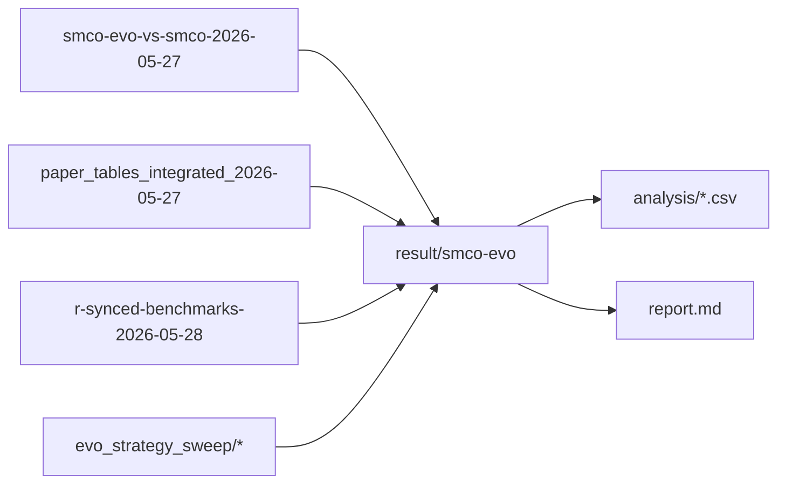
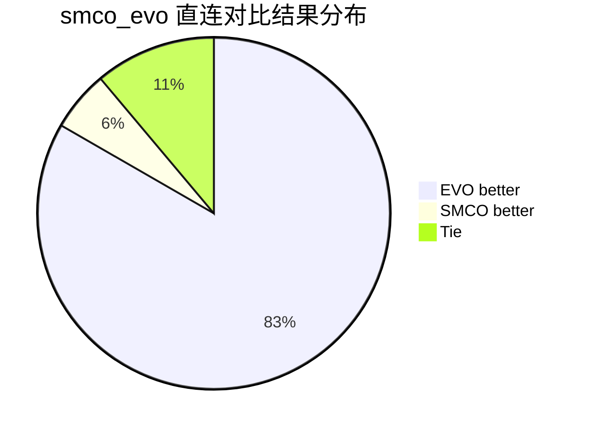
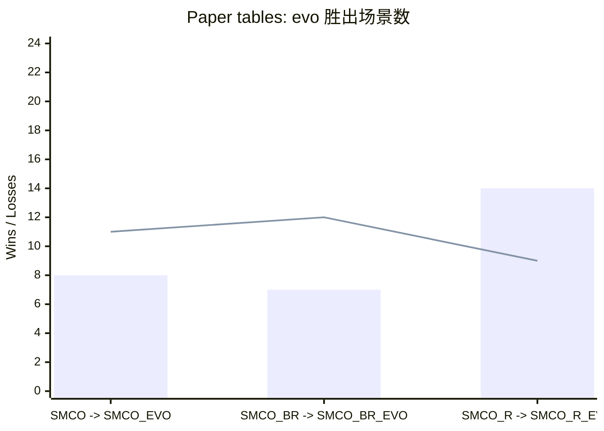
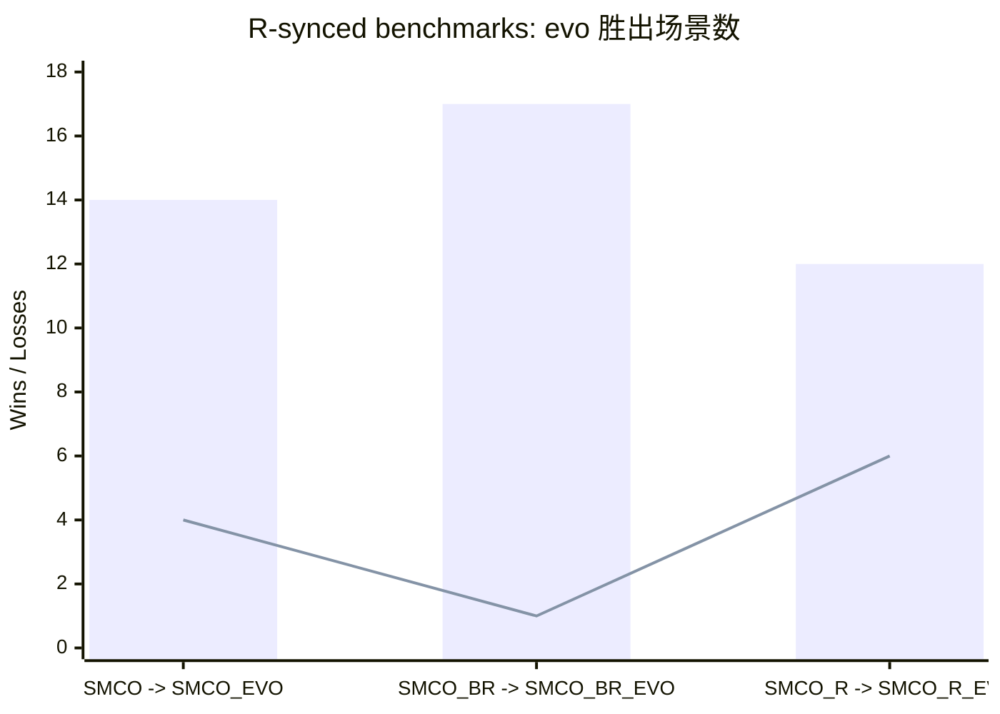
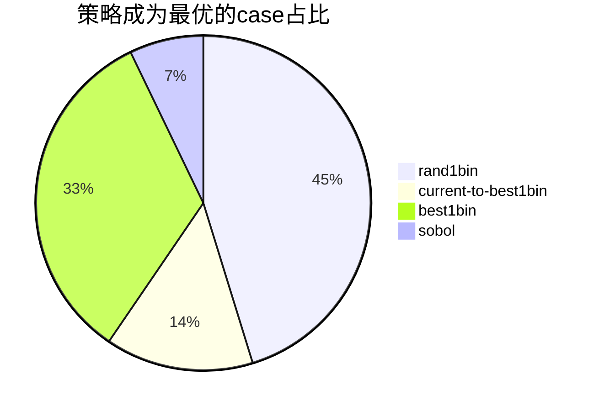

# SMCO-EVO Results Report

## 1. 结果目录与覆盖范围

本次整理后的统一目录为 `result/smco-evo/`，结构如下：

- `source/smco-evo-vs-smco-2026-05-27/`: 原始 `smco` vs `smco_evo` head-to-head 结果
- `source/paper_tables_integrated_2026-05-27/`: 论文 Table 1/2/3 整合结果
- `source/r-synced-benchmarks-2026-05-28/`: 从上游 R 同步到 Python 的 18 个 benchmark 全量结果
- `source/evo_strategy_sweep/`: 四种进化策略（`rand1bin/current-to-best1bin/best1bin/sobol`）对应结果
- `analysis/`: 本次新增的汇总表、pairwise 对比表和六个 SMCO 变体的排名统计

本报告主要回答两个问题：

1. `smco-evo` 相比原版 `smco` 是否稳定更好？
2. 把视角放大到 `SMCO / SMCO_R / SMCO_BR` 三条主线后，evo 变体是否普遍带来收益？

## 2. 核心结论

| metric | value |
| --- | --- |
| 18函数 head-to-head: evo 更优 | 15 |
| 18函数 head-to-head: 原版更优 | 1 |
| 18函数 head-to-head: 持平 | 2 |
| 重复层面: evo 胜 | 133 |
| 重复层面: 原版胜 | 18 |
| 重复层面: 平局 | 209 |

结论可以先概括成一句话：`smco-evo` 在直接 head-to-head 上明显占优，但把范围扩展到论文表格和全量 R-synced benchmark 后，收益并不是“无条件单调提升”，而是更偏向 **原版 SMCO 主线明显受益，refine/boosted 两条支线增益更混合**。

## 3. 直接对比：SMCO vs SMCO_EVO

这部分使用 `source/smco-evo-vs-smco-2026-05-27/summary.csv` 的 18 函数对照结果。这里的优势最直接，因为实验就是专门为了回答 `smco_evo` 是否比原版 `smco` 更有效。

### 3.1 改进最明显的函数

| function | dim | metric | basis | evo_win_reps | smco_win_reps | tie_reps |
| --- | --- | --- | --- | --- | --- | --- |
| Eggholder | 2 | 49.312 | gap_improvement | 10 | 0 | 10 |
| Mishra6 | 2 | 10.000 | rep_win_delta | 10 | 0 | 10 |
| Qing | 10 | 8.201 | gap_improvement | 6 | 0 | 14 |
| Michalewicz | 10 | 4.000 | rep_win_delta | 4 | 0 | 16 |
| Shubert | 2 | 2.544 | gap_improvement | 5 | 0 | 15 |
| Rosenbrock | 10 | 0.090 | gap_improvement | 10 | 2 | 8 |

### 3.2 回退或无增益最明显的函数

| function | dim | metric | basis | evo_win_reps | smco_win_reps | tie_reps |
| --- | --- | --- | --- | --- | --- | --- |
| Bukin6 | 2 | -0.015 | gap_improvement | 4 | 7 | 9 |

分析要点：

- `Eggholder`、`Qing10d`、`Shubert`、`Rosenbrock10d` 是这批数据里最明显的受益者，说明阶段性淘汰和补点在复杂地形、非凸或病态曲面上更能发挥作用。
- `Bukin6` 是最清晰的回退案例，说明 `rand1bin` 的补点在某些低维尖锐地形上可能打破了原版轨迹的局部精修节奏。
- `Michalewicz10d`、`Mishra6` 没有已知最优值字段，因此这里用重复层面的胜负差作为替代判据；它们总体仍偏向 `smco-evo`。

## 4. family 视角：论文 Table 1/2/3

这部分不只比较 `SMCO`，还比较 `SMCO_R` 与 `SMCO_BR` 的 evo 版本。统一指标是：

`mean gap = |best_opt - fopt_mean|`

gap 改进量定义为：

`gap improvement = gap(base) - gap(evo)`

值为正表示 evo 更好，值为负表示原版更好。

### 4.1 pairwise 汇总

| pair | scenarios | wins | losses | ties | win_rate | mean_gap_improvement | median_gap_improvement |
| --- | --- | --- | --- | --- | --- | --- | --- |
| SMCO -> SMCO_EVO | 20 | 8 | 11 | 1 | 40.0% | 1.055 | -0.000 |
| SMCO_BR -> SMCO_BR_EVO | 20 | 7 | 12 | 1 | 35.0% | 1.416 | -0.001 |
| SMCO_R -> SMCO_R_EVO | 24 | 14 | 9 | 1 | 58.3% | 743.801 | 0.000 |

### 4.2 六个 SMCO 变体谁最常拿到最优

| algo | best_count | average_rank |
| --- | --- | --- |
| SMCO_R_EVO | 7 | 2.333 |
| SMCO_EVO | 5 | 3.333 |
| SMCO_R | 5 | 3.083 |
| SMCO | 3 | 3.200 |
| SMCO_BR | 2 | 4.350 |
| SMCO_BR_EVO | 2 | 4.125 |

### 4.3 按 Table 1 / Table 2 / Table 3 拆开看

| group | pair | scenarios | wins | losses | ties | win_rate | mean_gap_improvement | median_gap_improvement |
| --- | --- | --- | --- | --- | --- | --- | --- | --- |
| table1 | SMCO -> SMCO_EVO | 8 | 4 | 3 | 1 | 50.0% | 0.005 | 0.000 |
| table1 | SMCO_BR -> SMCO_BR_EVO | 8 | 3 | 4 | 1 | 37.5% | 0.004 | -0.000 |
| table1 | SMCO_R -> SMCO_R_EVO | 8 | 5 | 2 | 1 | 62.5% | 0.024 | 0.000 |
| table2 | SMCO -> SMCO_EVO | 4 | 1 | 3 | 0 | 25.0% | -0.453 | -0.024 |
| table2 | SMCO_BR -> SMCO_BR_EVO | 4 | 2 | 2 | 0 | 50.0% | -0.802 | -0.004 |
| table2 | SMCO_R -> SMCO_R_EVO | 8 | 6 | 2 | 0 | 75.0% | 2234.003 | 0.222 |
| table3 | SMCO -> SMCO_EVO | 8 | 3 | 5 | 0 | 37.5% | 2.860 | -0.000 |
| table3 | SMCO_BR -> SMCO_BR_EVO | 8 | 2 | 6 | 0 | 25.0% | 3.937 | -0.002 |
| table3 | SMCO_R -> SMCO_R_EVO | 8 | 3 | 5 | 0 | 37.5% | -2.622 | -0.000 |

对论文表格的解释：

- `SMCO -> SMCO_EVO` 在论文表格里并不是稳定单调提升：`table1` 基本打平，`table2` 偏弱，`table3` 的均值收益主要来自少数 `EmpiricalWelfare` 大幅改善场景。
- `SMCO_R -> SMCO_R_EVO` 的总均值优势很大，但要注意其中有明显高维 outlier，不能只看 mean；从胜负场次看，它也不是“碾压式”提升。
- `SMCO_BR -> SMCO_BR_EVO` 在论文表格里是最混合的一组，说明 boosted 轨迹本身已经比较敏感，evo 注入的额外扰动不一定总是正收益。
- `table2` 的 200 维任务尤其关键，因为它们更能暴露中途淘汰是否真的改善了高维搜索，而不只是低维 lucky hit。

## 5. family 视角：R-synced 18 个 benchmark

这部分覆盖 18 个从上游 R 同步到 Python 的 benchmark，并且包含 comparison 方法全量结果。这里我们仍然只聚焦六个 SMCO 变体的内部对比。

### 5.1 pairwise 汇总

| pair | scenarios | wins | losses | ties | win_rate | mean_gap_improvement | median_gap_improvement |
| --- | --- | --- | --- | --- | --- | --- | --- |
| SMCO -> SMCO_EVO | 18 | 14 | 4 | 0 | 77.8% | 2.294 | 0.020 |
| SMCO_BR -> SMCO_BR_EVO | 18 | 17 | 1 | 0 | 94.4% | 3.376 | 0.007 |
| SMCO_R -> SMCO_R_EVO | 18 | 12 | 6 | 0 | 66.7% | 3.094 | 0.001 |

### 5.2 六个 SMCO 变体谁最常拿到最优

| algo | best_count | average_rank |
| --- | --- | --- |
| SMCO_BR_EVO | 7 | 2.389 |
| SMCO_R_EVO | 7 | 2.056 |
| SMCO_R | 3 | 2.722 |
| SMCO_EVO | 1 | 4.278 |
| SMCO | 0 | 5.389 |
| SMCO_BR | 0 | 4.167 |

这部分比论文表格更像“广覆盖压力测试”：

- 如果 `SMCO_EVO` 在这里仍能稳定压过 `SMCO`，说明它不是只对论文中的那几类任务有效。
- 如果 `SMCO_R_EVO` 或 `SMCO_BR_EVO` 的 best-count 和 average-rank 没有同步改善，那就说明 evo 的收益主要来自主线多起点搜索，而不是 refine / boosted 的后处理阶段。

## 6. 结论与建议

综合三类结果，`smco-evo` 的效果可以概括为：

1. **`smco-evo` 的正信号是真实存在的。** 直接 18 函数 head-to-head 是最干净的证据，`15/18` 函数更好，重复层面也是明显占优。
2. **但收益存在明显任务依赖。** 论文表格里，`SMCO_EVO` 和 `SMCO_BR_EVO` 都没有表现出“全场景稳定优于原版”的特征；`SMCO_R_EVO` 更强，但也受少数高维大收益点影响。
3. **在广覆盖的 R-synced benchmark 上，evo family 整体重新显示出强优势。** 这说明进化补点本身不是偶然有效，而是对更广泛的连续测试函数仍有价值。
4. **默认 `rand1bin` 只是其中一种可行策略，不应直接当作唯一结论。** 现在四种策略都已补齐，同一批基准上可以直接比较 `rand1bin / current-to-best1bin / best1bin / sobol` 的稳定性与收益分布。

## 7. 进化策略扫全量（新增）

本节比较 `rand1bin / current-to-best1bin / best1bin / sobol` 在已跑基准上的表现。  
统一指标仍是 `|reference_best_opt - fopt_mean|`，其中 `reference_best_opt` 来自主基线目录（不随策略变化）。

| strategy | covered_cases |
| --- | --- |
| rand1bin | 42 |
| current-to-best1bin | 42 |
| best1bin | 42 |
| sobol | 42 |

| strategy | algo | cases | mean_gap_to_reference | median_gap_to_reference |
| --- | --- | --- | --- | --- |
| rand1bin | SMCO_BR_EVO | 42 | 111.386 | 0.096 |
| rand1bin | SMCO_EVO | 42 | 87.219 | 0.216 |
| rand1bin | SMCO_R_EVO | 42 | 86.135 | 0.104 |
| current-to-best1bin | SMCO_BR_EVO | 42 | 112.917 | 0.107 |
| current-to-best1bin | SMCO_EVO | 42 | 87.918 | 0.223 |
| current-to-best1bin | SMCO_R_EVO | 42 | 87.801 | 0.102 |
| best1bin | SMCO_BR_EVO | 42 | 112.787 | 0.103 |
| best1bin | SMCO_EVO | 42 | 87.534 | 0.211 |
| best1bin | SMCO_R_EVO | 42 | 87.672 | 0.107 |
| sobol | SMCO_BR_EVO | 42 | 113.151 | 0.123 |
| sobol | SMCO_EVO | 42 | 88.152 | 0.308 |
| sobol | SMCO_R_EVO | 42 | 87.655 | 0.107 |

| strategy | best_case_count |
| --- | --- |
| rand1bin | 57 |
| current-to-best1bin | 18 |
| best1bin | 42 |
| sobol | 9 |

## 8. 生成文件清单

- `analysis/direct_smco_vs_evo_cases.csv`
- `analysis/direct_smco_vs_evo_top_improved.csv`
- `analysis/direct_smco_vs_evo_top_regressed.csv`
- `analysis/paper_pairwise_cases.csv`
- `analysis/paper_pairwise_summary.csv`
- `analysis/r_synced_pairwise_cases.csv`
- `analysis/r_synced_pairwise_summary.csv`
- `analysis/smco_family_best_counts.csv`
- `analysis/smco_family_best_cases.csv`
- `analysis/strategy_sweep_evo_rows.csv`
- `analysis/strategy_sweep_summary.csv`
- `analysis/strategy_sweep_best_strategy_by_case.csv`
