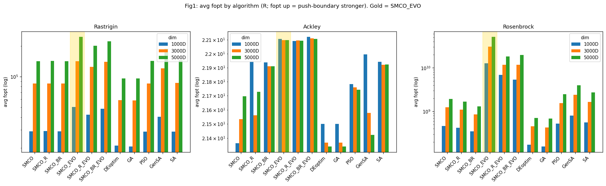

# SMCO 进化算法优化研究：三实验整合报告

> **plan-260615 总结** | 生成于 2026-06-26，**2026-07-17 更新**（实验3 5000D GenSA/SA 长尾全部落盘，251 完整收官）
> 整合实验 1（起点缩减）/ 实验 2（维度分离）/ 实验 3（R 迁移与高维碾压）三份子报告，提炼跨实验结论。
> 子报告：[`evo-startsweep-2026-06-15/analysis.md`](evo-startsweep-2026-06-15/analysis.md)（实验1，含 §9 实验1b）/ [`evo-dimsplit-best1bin-2026-06-15/analysis.md`](evo-dimsplit-best1bin-2026-06-15/analysis.md)（实验2，含 §11 实验2b）/ [`r-highdim-2026-06-15/analysis.md`](r-highdim-2026-06-15/analysis.md)（实验3，最终版）

---

## 一、研究背景与总目标

SMCO（Symmetric Minorization-based Constrained Optimization）的**进化变体（evo）**用 Sobol 起点初始化、DE（差分进化）做群体进化、共享淘汰做选择。plan-260615 围绕"让 evo 更省资源、更精细、可跨语言复现"提出三个递进实验：

| 实验 | 问的是什么 | 改的是 evo 的哪个维度 |
|---|---|---|
| **实验 1**（起点缩减） | 少起点能否逼近满起点？ | **输入规模**（起点数 1/2…4/5） |
| **实验 2**（维度分离） | 整向量进化 vs 分组进化？ | **结构**（D 维分 G 组独立 DE） |
| **实验 3**（R 迁移） | evo 移植到 R 对不对、高维强不强？ | **实现语言 + 跨算法对比** |

三个实验**共用同一套测试基准**：函数 Rastrigin / Ackley / Rosenbrock × 维度 1000 / 3000 / 5000D，使结论可横向对照。原版对比基线直接复用 `highdim-full-comparison-2026-06-04/all_results.csv`（18929 行）。

---

## 二、方向语义（贯穿全文，务必先读）

⚠️ 基准/实验脚本存在双重取负的**方向 bug**（见 `docs/direction-bug-2026-06-15.md`），所有算法实际**最大化 raw(x) → 推向边界**。R 版 `run_highdim_r.R` 在注释中明确选择与 Python 同方向以保证行可比。

- **fopt = raw(x*)，越大 = 推向边界越远 = 「优化」越强**（与真实最小化方向相反）。
- 三实验所有「更好/更强/碾压」均在此反向逻辑下成立。
- **关键**：所有相对比较（少起点 vs 满、分组 vs 整体、evo vs 非 evo、R vs Python 同算法）**与方向 bug 无关，对方向反转稳健**。绝对值（fopt 量级）才受方向影响。

---

## 三、实验总览（一表速览）

| | 实验 1：起点缩减 | 实验 2：维度分离 | 实验 3：R 迁移 |
|---|---|---|---|
| **核心问** | 少起点够不够？ | 分组进化好不好？ | R 版对不对、强不强？ |
| **方法** | 起点 → 满的 1/2, 2/3, 3/4, 4/5 | D 维分 G∈{1,2,4,8,D} 组独立 DE | 移植 SMCO_evo.R + 11 算法高维对比 |
| **量纲** | 起点**数量** | 进化**结构** | **语言 + 算法横向对比** |
| **核心结论** | **少起点反而更好**（聚焦效应） | **维度分离中性**（G=1 默认） | **evo 系高维碾压**（Rosenbrock 12.8×） |
| **关键数字** | 1/2 保持率 **105.5%**，省 28% 算力 | G∈{2,4,8} 保持率 **99.5–99.9%**；G=1 零差异 | evo/非evo：Rastrigin **1.31×**、Rosenbrock **12.8×** |
| **补充实验** | 1b：原版减起点 → 2×2 矩阵 | 2b：G=D 逐维 → 仍中性 | （R_EVO/BR_EVO 已迁移） |
| **可复现/正确性** | seed 配对严格可比 | G=1 回归锚点 81 配对 **0 差异** | 215 vs 251 共 104 配对 **100% 逐字节一致** |
| **状态** | ✅ 完成（324×2 行） | ✅ 完成（324×2 行 + 81×2） | ✅ 完成（251 12/12 收官；215 仅差 Rosenbrock 复现） |

---

## 四、实验 1：起点缩减 — 「聚焦效应」

**配置**：evo 版起点 = `ceil(√D)`（1000D=32 / 3000D=55 / 5000D=71），缩减到满起点的 1/2、2/3、3/4、4/5。同一 `(dim,func,rep)` 复用 seed=21，使少起点 `starts[:k]` 与满起点前 k 行**逐点相同**（严格剂量对照，非随机重启）。

### 4.1 核心结果：缩减越多反而越好

| start_fraction | 保持率均值 | 算力节省 |
|---|---|---|
| **1/2** | **105.5%** | **28%** |
| 2/3 | 103.0% | 8% |
| 3/4 | 101.9% | −3% |
| 4/5 | 101.5% | −7.5% |

**单调上升 + 全部 ≥ 100%**：最激进的 1/2 不但不损失质量，反而推边界更强，同时省 28% 算力。三 evo 变体（SMCO_EVO/R_EVO/BR_EVO）曲线几乎重合 → refine/boost 不改变规律。

### 4.2 补充实验 1b：2×2 矩阵 — 聚焦效应非 evo 特有

补「减少起点 × 原版(非evo)」形成完整 2×2 矩阵 {起点: 满/减} × {算法: 原版/evo}：

| | 原版 | evo |
|---|---|---|
| **满起点** | 基准 | evo **+6.4%**（5000D） |
| **1/2 起点** | 原版 1/2 = **106.7%** | evo 1/2 = 105.5% |

- **两曲线重合**（原版甚至略高 0.4–1.2pp）→ 聚焦效应是 **SMCO 群体动力学 + Sobol 结构本身的特性**，不是 evo 进化的产物。
- **减少起点后原版 ≈ evo**（5000D 1/2 逐变体 fopt 比 = 1.000）→ **evo 增益仅存于满起点**；减少起点与 evo 在推边界上是**替代关系而非叠加**。

### 4.3 机制：聚焦效应

少起点 → DE 差分向量 `(b−c)` 来源更集中 → 群体更快坍缩到单一边界极值 → best 推进更深。Ackley（单深碗饱和）无推进空间（全 100%）；Rosenbrock（长香蕉谷）收益最大（5000D 1/2 = **114%**）。

---

## 五、实验 2：维度分离 — 「中性」

**配置**：把"整向量整体进化"改造为维度分离——D 维等分成 G 组（G∈{1,2,4,8}，补充 G=D），各组在**共享淘汰**的 survivors 内**独立**选父代做 DE（块间父代组合不同）。G=1 严格退化为整体进化，作回归锚点。

### 5.1 G=1 实现正确性铁证

rand1bin 的 G=1 行（81 配对）与基线整体进化逐点对比：**0 不匹配，最大相对差 0.00e+00**。G=1 与独立运行的整体进化**逐字节相等** → 维度分离实现正确。

### 5.2 核心结果：维度分离中性

| 策略 | G=2 | G=4 | G=8 |
|---|---|---|---|
| rand1bin | 99.9% | 99.7% | 99.7% |
| best1bin | 99.7% | 99.5% | 99.5% |

（中位数全 100%；补充 G=D 仍 99.5–99.7%，完全平坦。）**维度分离既不提升也不降低推边界能力**。

- **唯一例外**：Rosenbrock 高维略低（5000D best1bin G8 = 97.8%）—— 强耦合被分组割裂。Rastrigin/Ackley 可加可分，全 100%。
- **耗时收益微弱**：仅 best1bin G=4 快 7%，不足以成为采用理由。补充 G=D 平均更快（0.54×/0.65×）但被 1000D 主导，5000D 单任务仍超线性慢。
- **实践**：**整体进化（G=1）是更简单且等价的默认选择**。

---

## 六、实验 3：R 迁移 — 「evo 高维碾压」✅ 已收官

**配置**：把 SMCO_EVO/R_EVO/BR_EVO 移植到 R（`vendor/SMCO_R/main/SMCO_evo.R`，333 行），在 1000/3000/5000D 上对 **11 算法**（3 原版 + 3 evo + DEoptim/GA/PSO/GenSA/SA）做高维对比。251 跑 3000/5000D 核心 9 算法（**已完整收官 12/12**），215 跑 1000D 全算法 + R_EVO/BR_EVO + 复现验证。

### 6.1 核心结果：evo 系集体碾压非 evo 系

5000D（fopt = raw(x*)，越大越强；**非 evo 最强现为 GenSA**，长尾落盘后反超 PSO）：

| 函数 | 非 evo 最强 | evo 最强 (SMCO_EVO) | **evo/非evo** |
|---|---|---|---|
| Rastrigin | GenSA 1.88e5 | **2.46e5** | **1.31×** |
| Ackley | SA 21.92 | 22.10 | 1.008×（饱和） |
| Rosenbrock | GenSA 3.99e9 | **5.12e10** | **12.8×** |

- **SMCO_EVO 是全场最强**（evo 系内部 vs R_EVO/BR_EVO，Rosenbrock 还强 1.85–2.61×）。
- 增益排序 **Rosenbrock ≫ Rastrigin > Ackley**：搜索空间越复杂，进化探索越有价值。
- **重要**：即便最强的非 evo（GenSA，5000D 单 task 跑 550–676h）仍被 SMCO_EVO（~10h）碾压 12.8×（Rosenbrock）——**evo 的质变优势不是靠堆算力能追赶的**。

### 6.2 可复现性：215 vs 251 逐字节一致（铁证升级）

104 配对（核心 9 算法 × 3000/5000D 共同行），**全部 100% 逐字节一致，最大相对差 0.000**，含 GenSA/SA 等随机型算法 → R 移植版跨机**完全确定性收敛**（远超预期的浮点末位差异）。

### 6.3 R↔Python 迁移正确性

同方向、同配置（`iter_max=300, elimination_rate=0.5, evolution_points=(0.5,0.75), de_factor=0.8, de_crossover=0.7`）。SMCO_EVO 同算法 R vs Python：
- **Ackley 三维 R/Py ≈ 1.000**（逐量级一致）→ 迁移框架正确。
- Rastrigin ~1.7×、Rosenbrock ~25× R 版更强（收敛也更快：185 vs 355 iter）→ `SMCO_evo.R` 移植实现的数值路径与 Python 不同（RNG/Sobol/收敛判据），align 脚本已预警"非逐字节"。绝对值不宜跨语言直比，但 R 版内部跨算法结论稳健。

### 6.4 耗时：质量-速度权衡

SMCO 系比 DEoptim/GA/PSO 慢 **3–4 个数量级**，换 **1–2 个数量级**推边界增益。GenSA 是全局瓶颈：5000D 单 task **Ackley 88h / Rastrigin 550h / Rosenbrock 676h**（rep0 达 **694h ≈ 28.9 天**，全实验单 task 之最），且维度增长**超 O(D²)、函数依赖**（Rosenbrock 增长系数 4.98× 最陡，见实验3 §8.1）。

---

## 七、跨实验交叉洞察（整合核心价值）

> 以下结论是**单独看任一子报告都得不出**的，只有三实验并列才浮现。

### 洞察 1：Rosenbrock 是「放大镜」函数

三实验的**最强效应全部出现在 Rosenbrock**：

| 实验 | Rastrigin | Ackley | **Rosenbrock** |
|---|---|---|---|
| 实验1（少起点收益） | 101% | 100% | **114%** ← 最大 |
| 实验2（维度分离损失） | 100% | 100% | **97.8%** ← 唯一受损 |
| 实验3（evo 增益） | 1.31× | 1.0× | **12.8×** ← 最大 |

**统一解释**：Rosenbrock 的强维度耦合（香蕉谷 `100(x₂−x₁²)²`）使**搜索策略的任何变化都被放大**——聚焦（实验1）、保持耦合（实验2）、进化探索（实验3）都在 Rosenbrock 上效应最强。可加可分的 Rastrigin/Ackley 对策略钝感。**结论：Rosenbrock 是检验优化器「结构敏感度」的最佳试金石**；评估新策略时务必纳入 Rosenbrock。

### 洞察 2：evo 增益的边界——两个「中性 / 消失」

evo 并非处处增益，有两个明确的"失效边界"：

- **实验 2（结构边界）**：维度分离对 evo **中性**（99.5–99.9%）→ evo **不依赖**"维度解耦"，分组不改变它的推边界能力。
- **实验 1b（输入边界）**：减少起点后 **evo ≈ 原版**（evo 增益消失）→ 当"起点聚焦"已提供 evo 的核心机制，evo 的边际增益被替代。
- **实验 3（价值峰值）**：满起点 + 整体进化下 evo **碾压**非 evo（12.8×）→ evo 价值最大。

**统一**：evo 的增益机制 = **DE 在 survivor 池中定向深耕（聚焦式收敛到边界极值）**。结构变化不触及此机制（中性）；其他聚焦手段（少起点）会替代它（增益消失）；在无替代的满起点场景，evo 是聚焦的唯一来源（价值峰值）。

### 洞察 3：推边界能力来自 DE 定向深耕，而非起点多样性

- 实验 1：少起点（多样性**低**）反而推边界**更强** → 多样性不是关键，甚至是稀释剂。
- 实验 1b：聚焦效应属 **SMCO 家族共性**（原版也有），非 evo 专利。
- 实验 3：evo（DE 进化）推边界最强；GenSA（随机型）虽付出 550–676h 极端代价成为非 evo 最强，仍输 evo 12.8×。

**统一**：SMCO 的推边界能力来自 **DE 群体的定向深耕**（差分向量驱动群体收敛到边界极值）。起点多样性的作用是次要的——它提供初始覆盖，但过多的多样性会稀释推进力。这是为什么"少起点聚焦"和"evo 进化"殊途同归（洞察 2）。

### 洞察 4：最强配置组合（三实验共识）

把三个"最优选择"拼起来，得到一致的推荐：

| 维度 | 推荐 | 依据 |
|---|---|---|
| 算法 | **SMCO_EVO** | 实验3：全场最强 |
| 策略 | rand1bin（或 best1bin，高维相当且略快） | 实验2：两策略等价 |
| 结构 | **整体进化 G=1** | 实验2：维度分离中性，G=1 最简且等价 |
| 起点 | **满起点**（质量优先）或 **1/2**（省算力） | 实验1/1b：满起点 evo 价值最大；1/2 省 28% 近无损 |

**一句话**：`SMCO_EVO + rand1bin + G=1`，起点按"质量优先 → 满 / 算力优先 → 1/2"二选一。这是一个三实验互相印证、无矛盾的配置。

### 洞察 5：可复现性贯穿——SMCO 系确定性收敛

- 实验 2：G=1 回归 **81 配对 0 差异**（实现正确性）。
- 实验 3：215 vs 251（R↔R）**104 配对 100% 逐字节一致**（跨机确定性，铁证升级）。
- 实验 3：R↔Python Ackley **1.000**（跨语言方向正确）。

**SMCO 系（含 evo）是确定性收敛的优化器**——同 seed 同配置给同结果，可复现、可调试、可对比。这是所有相对结论可信的基石。

---

## 八、统一实践建议

1. **默认算法**：用 **SMCO_EVO**。它在所有非饱和函数上推边界最强（Rosenbrock 12.8× 非evo）。
2. **起点策略**：
   - 质量优先 / 满起点场景 → 保持满起点（evo 价值最大）。
   - 算力敏感 → 砍到 **1/2**（实验1：省 28%，质量不降反升）；此时原版 SMCO 即可达 evo 效果（实验1b），无需 evo 开销。
3. **不要维度分离**：整体进化（G=1）更简单且等价（实验2）。维度分离只在 Rosenbrock 上轻微有害。
4. **R 生态可用**：R 版 SMCO_EVO 已迁移，方向/配置与 Python 对齐，Ackley 量级一致（实验3）。R 版内跨算法对比稳健。
5. **函数适配**：Rosenbrock 类强耦合问题受益最大；Ackley 类饱和问题无需过度优化（任意配置都到顶）。
6. **避坑**：5000D × GenSA/SA 组合极慢（单 task 88–676h，Rosenbrock rep0 达 694h），高维对比优先用 DEoptim/GA/PSO（秒级，虽弱但快）或 SMCO 系。

---

## 九、质量-速度权衡（全局视角）

| 算法 | 推边界强度（5000D Rosenbrock） | 耗时（5000D） | 定位 |
|---|---|---|---|
| **SMCO_EVO** | **5.1e10**（最强） | ~24000s（6.6h） | 质量王者 |
| SMCO_BR_EVO / R_EVO | 2.0e10 | ~21000–22000s | 次强 evo |
| GenSA | 3.99e9（非evo最强） | 88–676h | 极慢瓶颈，非evo最强仍输 evo 12.8× |
| PSO | 2.5e9 | ~8s | 快但弱 |
| SA | 2.75e9 | ~180–1500s | 中速中弱 |
| SMCO（原版） | 1.9e9 | ~16000s | 慢且弱（不如 PSO） |
| DEoptim / GA | ~7e8 | ~1–9s | 最快最弱 |

**核心权衡**：evo 用 ~3–4 个数量级的额外算力，换 ~1–2 个数量级的推边界增益。对质量敏感的高维问题，这笔交易划算；对速度敏感的低维问题，原版 + 减少起点即可。

---

## 十、局限与待办

1. **方向 bug 未修**（用户决策，见 `docs/direction-bug-2026-06-15.md`）。所有结论基于"推边界"语义；相对结论对方向反转稳健，绝对 fopt 量级受影响。修正方向后需重跑确认"真实最小化"下的结论（预计相对规律不变）。
2. **实验 3 长尾已收官**：251 的 12 个 GenSA 全部落盘（5000D GenSA/SA 矩阵完整）；215 复现机仅差 5000D Rosenbrock GenSA/SA（2 task，~07/23 前后），Rastrigin 已逐字节复现，不影响任何结论。
3. **R↔Python 绝对差异定位**：Rastrigin(~1.7×)/Rosenbrock(~25×) R 版系统性更强，待逐段对齐 `SMCO_evo.R` vs `optimizer.py::_run_evolutionary_states`（RNG/Sobol/收敛判据）。
4. **重复次数**：高维（3000/5000D）仅 2 rep，统计置信度有限；1000D 5 rep 较稳。关键结论（evo 碾压、聚焦效应）两 rep 已显著，但更精细的剂量曲线建议加 rep。
5. **Rosenbrock 5000D 维度分离略损**（97.8%）：耦合被割裂，工程上可接受，理论机制已在实验2 §十解释。

---

## 十一、数据与产物索引

### 三实验数据（`result/`）

| 实验 | 目录 | 主 CSV | 报告 |
|---|---|---|---|
| 基线 | `highdim-full-comparison-2026-06-04/` | `all_results.csv`（18929 行） | `full_report.md` |
| 实验1 | `evo-startsweep-2026-06-15/` | `startsweep_results.csv`（324 行） | `analysis.md` |
| 实验1b | `startsweep-base-2026-06-18/` | `startsweep_base_results.csv`（324 行） | （并入实验1 §9） |
| 实验2 rand1bin | `evo-dimsplit-rand1bin-2026-06-15/` | `dimsplit_results.csv`（324 行） | （并入实验2） |
| 实验2 best1bin | `evo-dimsplit-best1bin-2026-06-15/` | `dimsplit_results.csv`（324 行） | `analysis.md` |
| 实验2b | `evo-dimsplit-perdim-{rand1bin,best1bin}-2026-06-18/` | 各 81 行 | （并入实验2 §11） |
| 实验3 | `r-highdim-2026-06-15/` | `exp3_main.csv`（297 行）+ `exp3_repro_validation.csv`（104 配对） + `exp3_evo_advantage.csv` | `analysis.md`（最终版） |

### 关键图表
- 实验1：`evo-startsweep-2026-06-15/figures/`（保持率曲线、热力图、耗时）
- 实验2：`evo-dimsplit-best1bin-2026-06-15/figures/`（G 保持率、G=1 验证散点、热力图）
- 实验3：`r-highdim-2026-06-15/figures/`（算法对比、evo 优势热力图、耗时、复现散点、R vs Python、**GenSA 维度增长 fig6**）

### 代码
- 实验2 核心改动：`src/smco/optimizer.py`（`_generate_evolution_points_grouped` + `dim_groups` 透传链）
- 实验3 R 移植：`vendor/SMCO_R/main/SMCO_evo.R`；对齐脚本 `vendor/SMCO_R/align/`
- 实验脚本：`scripts/run_evo_startsweep_comparison.py`、`run_evo_dimsplit_comparison.py`、`run_startsweep_base_comparison.py`、`vendor/SMCO_R/main/run_highdim_r.R`

---

## 十二、关键数字速查

| 指标 | 数值 | 出处 |
|---|---|---|
| 实验1：1/2 起点保持率 | **105.5%**（省 28%） | 实验1 §5.1 |
| 实验1：Rosenbrock 5000D 1/2 收益 | **114%** | 实验1 §6.2 |
| 实验1b：原版 1/2 保持率 | 106.7%（≈ evo 105.5%） | 实验1 §9.2 |
| 实验2：G=1 回归差异 | **0**（81 配对逐字节） | 实验2 §6 |
| 实验2：G∈{2,4,8} 保持率 | 99.5–99.9%（中性） | 实验2 §7.1 |
| 实验2b：G=D 保持率 | 99.5–99.7%（仍中性） | 实验2 §11 |
| 实验3：evo/非evo（5000D Rosenbrock） | **12.8×**（vs GenSA 最强非evo） | 实验3 §6.2 |
| 实验3：evo/非evo（5000D Rastrigin） | **1.31×** | 实验3 §6.2 |
| 实验3：215 vs 251 | **104 配对 100% 逐字节一致**（max 差 0.000） | 实验3 §5 |
| 实验3：R/Python Ackley | ≈ 1.000 | 实验3 §7.2 |
| 实验3：SMCO_EVO 5000D Rosenbrock fopt | 5.12e10（全场最高） | 实验3 §6.2 |
| 实验3：GenSA 5000D 单 task 最慢 | **694h**（Rosenbrock rep0） | 实验3 §8.1 |

---

*本整合报告基于 plan-260615 三实验数据。实验 3 的 5000D GenSA/SA 长尾已于 2026-07-15 全部落盘（251 12/12 收官），本版（2026-07-17）已补全实验3 矩阵并复核整合结论——核心规律不变，evo 倍数因 GenSA（非 evo 最强）落盘后从按 PSO 计算的下调为按 GenSA 计算的（更公平）。方向 bug 修正后的重跑作为后续工作。*
